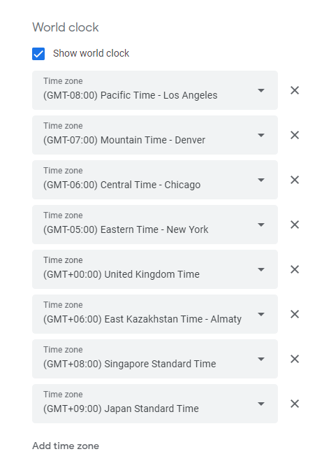
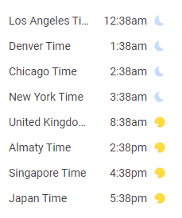

# Google tips

## Chrome

### Export search engines from Chrome as CSV

Windows

```pwsh
C:\> sqlite3.exe -csv "$ENV:LOCALAPPDATA\Google\Chrome\User Data\Default\Web Data” "select short_name,keyword,replace(url,'{searchTerms}','%s') from keywords;" > engines.csv
```

Linux

```bash
sqlite3 -csv ~/.config/google-chrome/Default/Web\ Data "select short_name,keyword,replace(url,'{searchTerms}','%s') from keywords;" > engines.csv
```

Sample output

```csv
GitHub,gh,https://github.com/search?q=%s&ref=opensearch
"linux man pages",man,https://www.die.net/search/?q=%s
"tanium community",tanium,https://community.tanium.com/s/global-search/%s
"Google Maps",gmaps,https://www.google.com/maps/search/%s?hl=en&source=opensearch
```

### Clear DNS cache

`chrome://net-internals/#dns`

### Change User Agent in Google Chrome

1. `CTR+Shift+I`
1. More Tools > Network Conditions. ...
1. Uncheck Select Automatically Checkbox.

## Search

Search for document

```conf
intitle:"index of" "<file_name>.pdf"
intitle:"index of" "A Berger-Levy Energy Efficient Neuron Model with Unequal Synaptic Strengths 2012-4316.pdf"
```

Show login

```conf
site:cnn.com inurl:login
allintitle: "smart office suite - login page"
intitle:"Documentation Index" intext:"Apache Tomcat Servlet" inurl:"docs"
```

### [The table of working operators](https://ahrefs.com/blog/google-advanced-search-operators/)

| Search operator | What it does | Example |
| --- | --- | --- |
| weather: | Search for the weather in a location. | weather: Salzburg |
| stocks: | Search for stock information for a ticker. | stocks:orcl |
| map: | Force Google to show map results. | map: Mexicali |
| movie: | Search for information about a movie. | movie:The Adventures of Baron Munchausen |
| in | Convert one unit to another. | 50 eur in chf |
| mod | Calculate modulus. | 197 mod 13 |
| “ ” | Search for results that mention a word or phrase. | “larry ellison”|
| OR  | Search for results related to X or Y. | ellison OR miner |
| \| | Same as OR: | ellison \| miner |
| AND | Search for results related to X and Y. | ellison AND miner |
| - | Search for results that don’t mention a word or phrase. | ellison -oracle|
| * | Wildcard matching any word or phrase. | ellison * oracle |
| ( ) | Group multiple searches. | (DB OR Database) oracle |
| define: | Search for the definition of a word or phrase. | define:entrepreneur |
| cache: | Find the most recent cache of a webpage. | cashe:oracle.com |
| filetype: | Search for particular types of files (e.g., PDF). | Oracle linux filetype:pdf |
| ext: | Same as filetype: | Oracle linux ext:pdf |
| site: | Search for results from a particular website. | site:oracle.com solaris |
| related: | Search for sites related to a given domain like  login.oracle.com docs.oracle.com | related:oracle.com |
| intitle: | Search for pages with a particular word in the title tag. | intitle:solaris |
| allintitle: | Search for pages with multiple words in the title tag. | intitle:solaris kernel 10 |
| inurl: | Search for pages with a particular word in the URL. | inurl:solaris |
| allinurl: | Search for pages with multiple words in the URL. | allinurl:solaris kernel 10 |
| intext: | Search for pages with a particular word in their content. | intext:solaris |
| allintext: | Search for pages with multiple words in their content. | allintext:solaris kernel 10 |
| source: | Search for results from a particular source in Google News. | oracle source:WSJ |
| before: | Search for results from before a particular date. | oracle before:1999-2-12+before%3A2007-06-29 |
| after: | Search for results from after a particular date. | oracle after:1999-2-12 |

## Gmail and Calendar

### Show keyboard shortcuts in gmail and calendar

`Shift ?`

## [Search in gmail](https://support.google.com/mail/answer/7190?hl=en)

`Settings > Inbox > Inbox type > Multiple inboxes`

```txt
in:inboxnewer_than:1d
in:inbox older_than:1d newer_than:2d 
in:inbox older_than:2d newer_than:7d
in:inbox older_than:7d
in:inbox older_than:30d
din:inbox older_than:7d
```

| What you can search by | Search operator & example |
| --- | --- |
| Specify the sender | from:Luk |
| Specify a recipient | to:
| Specify a recipient who received a copy | cc: bcc: |
| Words in the subject line | subject: |
| Messages that match multiple terms | OR or { } from:amy OR from:david {from:amy from:david} |
| Remove messages from your results | -movie |
| Find messages with words near each other. Use the number to say how many words apart the words can be | holiday AROUND 10 vacation |
Add quotes to find messages in which the word you put first stays first. |  "secret AROUND 25 birthday" |
| Messages that have a certain label | label: |
| Messages that have an attachment | has:attachment |
| Messages that have a Google Drive, Docs, Sheets, or Slides attachment or link | has:drive has:document has:spreadsheet has:presentation has:youtube|
| Messages from a mailing list | list:<info@example.com>|
| Attachments with a certain name or file type | filename:pdf filename:text.txt |
| Search for an exact word or phrase | "dinner and movie tonight" |
| Group multiple search terms together | subject:(dinner movie) |
| Messages in any folder, including Spam and Trash | in:anywhere movie |
| Search for messages that are marked as important | is:important label:important |
| Starred, snoozed, unread, or read messages | is:starred is:snoozed is:unread is:read |
| Messages that include an icon of a certain color | has:yellow-star has:blue-info |
| Recipients in the cc or bcc field | cc:Julo bcc: Note: You can't find messages that you received on bcc. |
| Search for messages sent during a certain time period | after: before: older: newer:2004/04/16 |
| Search for messages older or newer than a time period using d (day), m (month), and y (year) | older_than: newer_than:2d |
| Search by email for delivered messages | deliveredto: |
| Messages in a certain category | category: social |
| Messages larger than a certain size in bytes | size:10000000 |
| Messages larger or smaller than a certain size in bytes | larger: smaller: 10M |
| Results that match a word exactly | +unicorn |
| Messages with a certain message-id header | rfc822msgid:<200503292@example.com> |
| Messages that have or don't have a label | has:userlabels has:nouserlabels |

_Note: When using numbers as part of your query, a space or a dash (-) will separate a number while a dot (.) will be a decimal. For example, 01.2047-100 is considered 2 numbers: 01.2047 and 100._

### Show World clock or multiple time zones

in `settings`




