+++
title = 'DRAFT Enterprise Security Through Architectural Constraints'
summary = '''TODO DRAFT'''
date = 2026-07-01T08:00:00-00:00
draft = false
tags = ['SecurityArchitecture', 'Technology', 'CyberSecurity']
mermaid = true
+++

by Adrián Bíro

> _This material is intended as a **pre-read for a knowledge sharing session** and is currently a **draft version**, not a final or prescriptive framework.
> It intentionally focuses on architectural thinking and design principles, and therefore does not provide full implementation guidance.
> Some additional sections, supporting materials, and extended models are included  as work-in-progress content. These are included for discussion purposes and may evolve further.
> The concepts presented here should be treated as a **discussion aid and perspective**, not as a ready-to-apply blueprint. They assume a certain level of architectural maturity and require adaptation to the specific context, capabilities, and risk appetite of the organization.
> The goal is to **stimulate structured thinking about invalid states and early control points**, and to support a more disciplined approach to security architecture through collective discussion during the session._

This guide applies the concept of **negative space**, borrowed from software engineering, to enterprise IT security architecture. It is written as a long-read pre-workshop text for architects, security practitioners, platform teams, and technical leaders who want a more disciplined way to think about structural prevention in complex environments.

In software engineering, negative space programming is the practice of defining not only what the program should do, but also what it should **never** do, what states are invalid, and what assumptions must be enforced explicitly at the boundary of the system. Rather than allowing ambiguous or malformed conditions to move deeper into the code and become harder to debug later, the system rejects them early through strict contracts, assertions, guard clauses, and fail-fast behavior.

Applied to security architecture, the same principle becomes highly relevant. Most enterprise architectures are still described primarily in terms of positive space: what identities are allowed to access which systems, what traffic is permitted, what services are expected to communicate, and what business workflows must remain available. Negative space adds the missing surrounding discipline. It asks what the architecture must **forbid by design**, what states must be structurally impossible, what data paths should never exist, what execution patterns should never be allowed to reach production, and what assumptions must be made explicit before the system can be called secure.

This perspective does not replace familiar security concepts such as **Zero Trust**, **least privilege**, **policy as code**, **micro-segmentation**, **continuous access evaluation**, **admission control**, **confidential computing**, or **data minimization**. Instead, it helps connect them into a more coherent architectural model. It gives them a common intellectual center: not merely what should be allowed, but what the platform should be designed to make impossible.

## The definition and architectural meaning

Negative space in security architecture is the set of invalid, untrusted, or structurally unacceptable states that surround a valid business capability.

The positive space describes the intended business outcome. A user authenticates. A workload reads from a database. An application processes a request. A deployment pipeline releases new code. A machine identity invokes a downstream service. These are visible, approved functions.

The negative space consists of the assumptions around those functions, including assumptions that often remain undocumented or distributed across different teams and layers. It includes conditions such as:

* the request originates from a legitimate and managed device
* the session remains trustworthy after authentication
* the payload exactly matches the expected contract
* the workload does not initiate arbitrary outbound communication
* the database is not internet-reachable
* the image does not run unless it came from an approved pipeline
* sensitive data never appears in a testing environment
* privileged access does not exist permanently without explicit approval and expiry

Traditional architecture often leaves these assumptions scattered across policies, review processes, operational procedures, exception handling, and tribal knowledge. Negative space architecture moves them into the design itself.

This changes the central design question. Instead of asking **only**: _What should this system allow?_ it **also** asks: _What must this system make impossible?_

That distinction matters because many security failures are not caused by the total absence of controls. They are caused by hidden assumptions, weak defaults, fallback paths, inconsistent enforcement, and invalid states being tolerated long enough to spread across systems and become difficult to isolate.

Negative space architecture treats those surrounding invalid conditions as first-class design objects. It does not merely hope they will be detected later. It defines them early and places enforcement where they can be rejected before they become operational reality.

### Negative space concept mapping into standard security language

| Negative space concept               | Standard security term / pattern           |
| ------------------------------------ | ------------------------------------------ |
| Continuous session validation        | Continuous Access Evaluation (CAE)         |
| No permanent privileged access       | Zero Standing Privileges (ZSP)             |
| Time-bound elevated access           | Just-in-Time access (JIT)                  |
| Block unmanaged or unhealthy devices | Device posture / endpoint compliance       |
| Reject invalid deployments upfront   | Policy as Code / admission control         |
| Only approved cloud patterns exist   | Guardrails / landing zones                 |
| Reject malformed input at entry      | Schema validation / input validation       |
| Only trusted artifacts may run       | Software supply chain security / signing   |
| Prevent lateral movement by design   | Micro-segmentation / Zero Trust networking |
| Encrypt execution and verify runtime | Confidential computing / attestation       |
| Replace sensitive values             | Tokenization / data masking                |
| Destroy access via key destruction   | Cryptographic erasure                      |
| Restrict outbound communication      | Egress filtering / private subnet design   |
| Validate AI actions before execution | AI guardrails / output validation          |

## Why this matters in enterprise environments

Most large organizations do not fail because they forgot security exists, but they fail because security is implemented unevenly, too late, or only as a secondary layer on top of flexible systems that were never structurally constrained.

Typical enterprise risk emerges from patterns such as:

* trust assumptions left implicit
* controls applied inconsistently across platforms
* exceptions becoming the real operating model
* flexible infrastructure deployed without strong guardrails
* invalid conditions spreading across layers before anyone notices
* detective controls compensating for weak preventive architecture

A conventional architecture discussion often sounds like this:

* users need access to applications
* applications need access to data
* services need to communicate
* engineers need flexibility to deploy and operate

But questions should also include:

* under what conditions must a session become invalid even if login succeeded?
* what communication path should never exist at all?
* what infrastructure state must be undeployable?
* what software artifact must never be executable in production?
* what data should never leave a given boundary?
* what fallback method should be removed even if it is operationally convenient?

This mindset reduces ambiguity. It also sharpens threat modeling because the architecture becomes explicit about what is structurally forbidden, not only what is administratively discouraged.

In regulated and high-dependency environments, that matters a great deal. Security architecture is not only about whether a control exists on paper. It is about whether an unsafe state can exist long enough to matter.

## Designing around invalid states

 >Negative vs positive space framing

| Positive space (what is allowed) | Negative space (what must be impossible)        |
| -------------------------------- | ----------------------------------------------- |
| Users can access applications    | Access from unmanaged or unsafe devices         |
| Services communicate             | Unapproved or undocumented communication paths  |
| Data is processed                | Data appearing in unauthorized environments     |
| Infrastructure is deployed       | Insecure or non-compliant configurations        |
| Code runs in production          | Unsigned or untrusted artifacts executing       |
| AI generates outputs             | Outputs directly triggering unvalidated actions |

The most practical use of negative space is to define invalid states before defining allowed workflows.

A conventional design sequence often looks like this:

* design the intended process
* add controls around it
* add logging
* add detections
* handle exceptions later

A negative space sequence reverses the logic:

* identify the critical business capability
* identify the assets and dependencies around it
* define the states that must never occur
* define the assumptions that must always hold
* enforce those assumptions at the earliest possible boundary
* only then define the allowed path

This creates a more demanding standard for architectural quality. A good architecture is not only one that enables a valid workflow. It is one that avoids creating unnecessary attack surface, ambiguity, and recovery burden. In that sense, elegance comes partly from omission. A system becomes better not only because of what it can do, but because of what it refuses to permit.

Examples make this clearer.

A user session may be valid only if:

* the credential is correct
* the device is healthy
* the access path is expected
* the geographic pattern is plausible
* the token is current
* the privilege level is justified

A deployment may be valid only if:

* the artifact is signed
* provenance is verified
* the target region is approved
* encryption and logging are enabled
* the change came through a trusted path
* manual bypass is not possible

A data transaction may be valid only if:

* the schema is exact
* required fields are present
* values are strongly typed
* no uncontrolled fields are included
* the destination environment is permitted to receive the data

This is haw negative space stops being a metaphor and becomes an architectural method.

## From software contracts to security boundaries

One of the strongest analogies from software engineering is the **contract**. In code, a function should not quietly accept malformed input and hope downstream logic will compensate. If the contract requires a field, a type, a structure, or a range, then invalid input should be rejected immediately. Otherwise the invalid state propagates, making the system harder to reason about and significantly harder to secure. The same is true at enterprise security boundaries.

A weak architectural pattern looks like this:

* external input arrives
* the perimeter accepts it loosely
* downstream services interpret it differently
* inconsistent records are saved
* alerts appear later across multiple systems
* root cause becomes difficult to reconstruct

A negative space pattern looks different:

* the input reaches a strict boundary
* schema, structure, types, and context are validated immediately
* unexpected fields are rejected
* malformed or out-of-policy values are blocked
* bad data never enters internal processing at all

In security language, this connects to:

* API schema validation
* strict input validation
* contract enforcement
* admission control
* perimeter policy enforcement

The architectural lesson is here is that **an invalid state rejected at the edge is a control. The same invalid state discovered deep inside the environment is an incident.**

## The control plane and the data plane

Negative space architecture depends on enforcing decisions before execution. This makes the distinction between **control plane** and **data plane** central.

The **control plane** is where validity is determined. It evaluates whether identity, context, configuration, payload, policy, or runtime conditions fall inside the acceptable state.

The **data plane** performs the actual business action only after that validation has happened.

If a system evaluates policy only after data has moved, infrastructure has been created, or session trust has already spread to downstream services, then the architecture is reactive. It may still have controls, but they are late controls. They are trying to contain invalid states after they have already entered the environment.

A negative space architecture puts decision authority before execution.

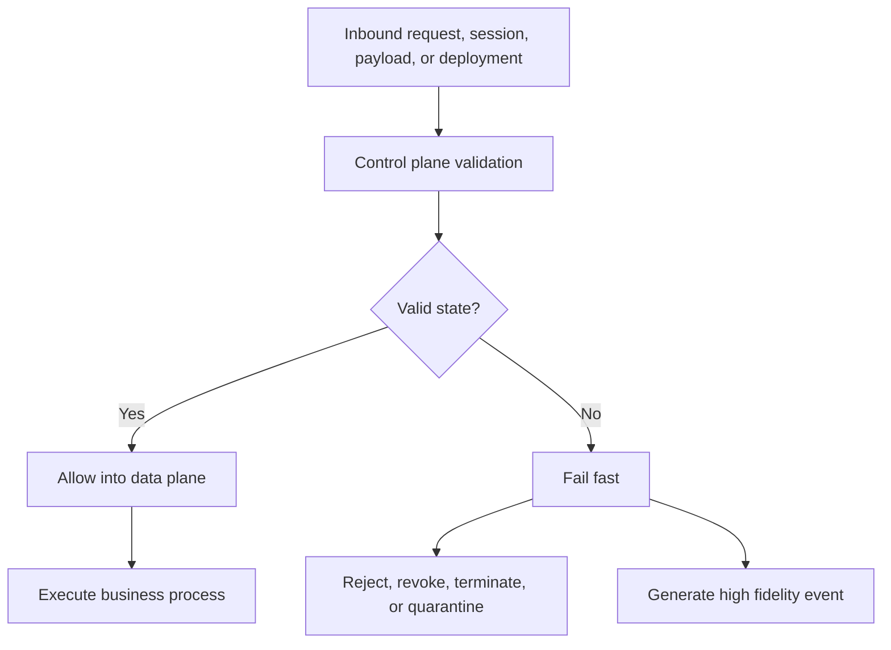

This pattern appears in many technical forms:

* identity provider policy engines
* API gateways
* cloud governance layers
* CI/CD policy checks
* runtime admission control
* service mesh policy engines
* key management systems
* tokenization boundaries
* egress control points

The implementation varies, but the principle remains consistent:, **the architecture must decide validity before the invalid state is allowed to spread.**

This is why negative space is not just about blocking. It is about placing control where it has the highest leverage.

### Control placement model

| Domain           | Control plane location            | What is enforced early                         |
| ---------------- | --------------------------------- | ---------------------------------------------- |
| Identity         | Identity provider / access policy | Session validity, device, context              |
| API / Ingress    | API gateway                       | Schema, structure, payload correctness         |
| Cloud / Platform | Policy engine / IaC pipeline      | Deployment constraints, configuration validity |
| DevSecOps        | CI/CD + admission controller      | Artifact trust, provenance, security gates     |
| Runtime          | Service mesh / runtime policies   | Service-to-service authorization               |
| Data             | Tokenization / KMS boundary       | Data exposure, plaintext visibility            |
| Network          | Segmentation / egress controls    | Allowed communication paths                    |
| AI               | Policy layer / execution wrapper  | Action validation, scope enforcement           |

# Security Domains

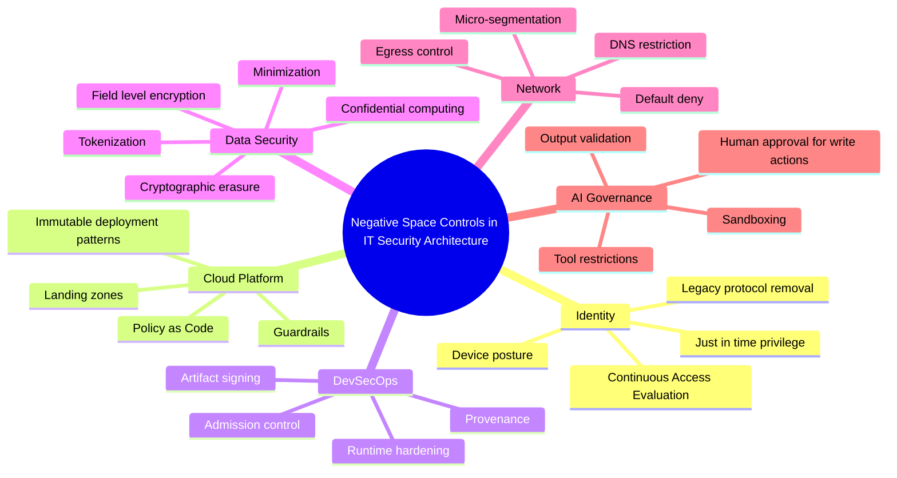

Before diving into individual domains, it is useful to understand that negative space is not applied as a single control, but as a **consistent design lens across core architecture layers**. Each domain (identity, cloud, delivery, data, network, AI) represents a distinct control plane where assumptions can be made explicit and enforced early. The purpose of the following sections is not to treat these domains in isolation, but to show how negative space thinking can be applied systematically across them, reducing ambiguity, constraining unsafe states, and aligning architecture around clear, enforceable boundaries.

## Identity and access management

Identity is one of the clearest places to apply negative space thinking.

Traditional identity models focus on success conditions: valid credential, successful multifactor authentication, correct role membership, approved application access. Negative space identity architecture assumes those mechanisms matter, but also assumes that credentials will eventually be stolen, replayed, phished, delegated inappropriately, or otherwise misused. Then with this in mind question becomes: **Under what surrounding conditions must the session be treated as invalid even if authentication technically succeeded?**

This includes conditions such as:

* unmanaged devices
* unhealthy devices
* impossible travel
* unexpected network paths
* sudden privilege escalation
* long-lived access tokens
* legacy authentication methods
* persistent privileged entitlements

A negative space identity architecture aligns naturally with existing concepts such as:

* **Continuous Access Evaluation**, where trust is reevaluated during a session
* **Device posture assessment**, where device health becomes part of the decision
* **Just-in-Time access**, where privileged access exists only for a short approved interval
* **Zero Standing Privileges**, where permanent privileged access is removed by design
* **Legacy authentication blocking**, where fallback protocols are retired rather than tolerated indefinitely

A stronger IAM design therefore does not stop at granting access. It continuously evaluates whether the context still falls inside the valid state.

Examples of negative space identity controls include:

* no administrative session from an unmanaged device
* no access if disk encryption is disabled
* no valid session after a major network context shift during sensitive activity
* no permanent production administrator access
* no access over obsolete protocols even for older systems
* no privilege escalation without explicit approval and time-bounded expiry

This creates friction, but it is selective friction. It is not designed to punish all users equally. It is designed to invalidate known unsafe conditions. The principle is that trust is contextual and perishable. Access should not survive simply because authentication happened once.

> This diagram shows how negative space changes identity from simple authentication to continuous contextual trust evaluation.

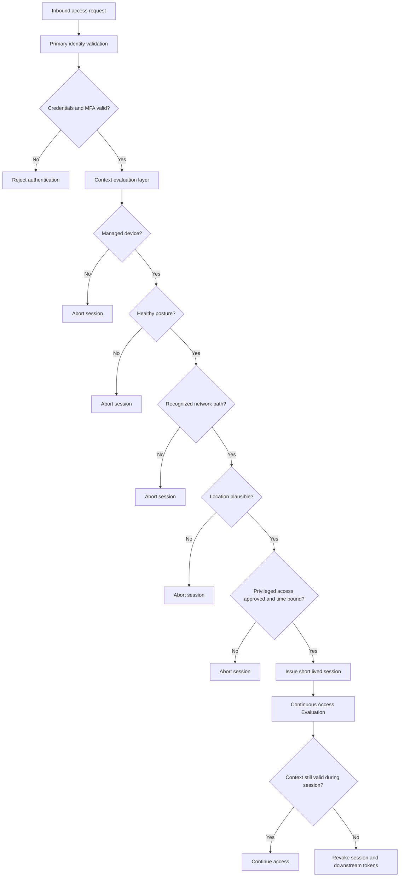

## Platform engineering and cloud guardrails

Cloud environments often accumulate risk via flexibility. Teams are given deployment freedom, templates multiply, exceptions are normalized, and the platform gradually supports many more states than the business ever intended. Security then responds with scanners, dashboards, drift reports, and remediation campaigns. These may be useful, but they often reveal a design problem that the platform still permits too many insecure or ambiguous states to exist in the first place.

Negative space architecture takes a different approach. It asks **what cloud states should never be deployable at all?**

That question maps directly to familiar control patterns such as:

* landing zones
* cloud guardrails
* service control policies
* policy as code
* infrastructure as code
* GitOps
* preventive governance
* admission control

From a negative space perspective, a secure cloud platform is not one that detects unsafe states later. It is one that rejects them at the earliest governance layer.

States that should often be structurally forbidden include:

* public storage without explicit approval
* databases with public endpoints
* resources without encryption
* resources without logging
* deployment in unapproved geographies
* direct human modification of production infrastructure
* unmanaged workloads outside approved deployment templates

This represents a shift from reviewing configurations after deployment to making insecure configurations impossible in the first place. If a cloud platform permits insecure states and depends on subsequent scanning to detect them, the scanner becomes the first effective control. That is a sign of weak architectural design.

A stronger model pushes control earlier:

* the bad state should fail the template
* if it passes the template, it should fail policy evaluation
* if it passes policy, it should fail admission
* if it still appears, it should fail runtime permissions

The architectural aim is not more policies on paper. It is fewer unsafe capabilities in the platform itself. Variance is often hidden attack surface. Negative space reduces variance by removing unsupported states from the system’s actual capability set.

> Diagram shows how insecure cloud states are rejected before they become part of the platform.

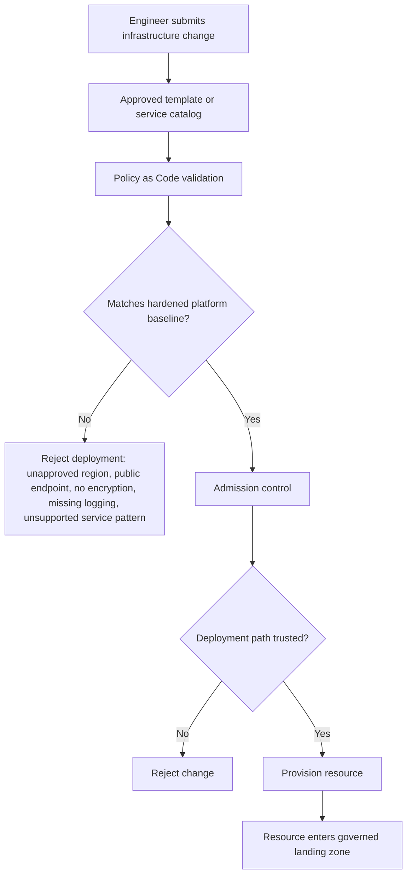

## Application security and software supply chain

In software engineering, negative space programming prevents invalid data from moving deeper into the application. In software delivery, the same principle applies to execution itself.

Many organizations say they have shifted left because they added more scanning in the build pipeline. That is helpful, but it does not fully express negative space thinking. The more important question is **what software artifact should production be structurally unable to run?**

The answer usually includes:

* unsigned artifacts
* artifacts without trusted provenance
* builds that failed mandatory security gates
* images with critical unresolved vulnerabilities
* workloads with excessive runtime permissions
* workloads deployed manually outside the approved path
* binaries copied directly into production environments
* workloads allowed to mutate their own execution environment

This connects to established concepts such as:

* software supply chain security
* artifact signing
* provenance
* break-the-build thresholds
* runtime hardening
* read-only root filesystems
* admission controllers
* immutable infrastructure

The architectural point is simple. A scanner that raises an alert is not the same thing as an execution boundary that blocks unsafe artifacts from running. If an administrator can still bypass the pipeline manually, then the architecture still contains a large ungoverned space.

Negative space is not a dashboard. It is an enforced boundary. The strongest software delivery architecture encodes approval assumptions into the path itself. It does not rely on operators remembering what is safe.

> This shows how negative space is enforced in the delivery chain so untrusted artifacts never become runnable.
>
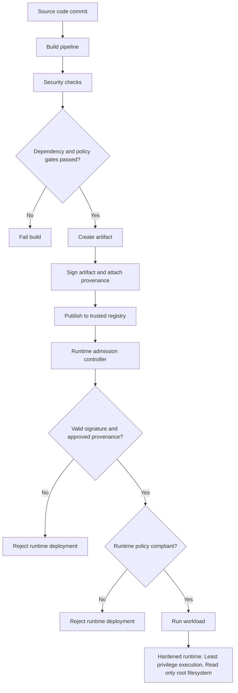

## Data security and cryptographic boundaries

Data security is often described in terms of who may access data, where it is stored, and how it is encrypted at rest or in transit. Negative space add questions such as:

* Should this data exist here at all?
* Should this environment ever receive real values?
* Should this system ever see plaintext?
* Should this record still exist after its business utility has ended?

This leads to several usefull architectural patterns.

### Data minimization

The most secure data is often the data that was never collected, never duplicated, or was deleted as soon as it stopped being necessary. This approach focuses on:

* collecting only required fields
* keeping data only for a defined purpose
* deleting it automatically when that purpose ends
* preventing silent spread into test, analytics, or support environments

### Tokenization and de-identification

Sensitive values can be replaced at the boundary with reference tokens or transformed forms so that downstream systems can function without seeing the original content.

This is useful where the business process requires referential consistency but not direct access to the raw value.

### Application-layer and field-level encryption

If sensitive data is encrypted before leaving the application boundary, then storage systems and some operational layers never see plaintext at all.

This changes the trust model. The question is no longer only whether the storage system is secure, but whether the architecture minimized the number of places where plaintext was ever present.

### Cryptographic erasure

When security architectures rely on encryption by default, data can be effectively retired by removing the keys needed to decrypt it. Lifecycle control becomes part of the system design, not just an operational process.

The broader lesson is that data protection is not solely about managing who can access information. It is equally about minimizing where that information exists. The fewer locations where raw data can appear, the smaller the risk surface. That is negative space applied in its most fundamental form.

> This diagram focuses on reducing where sensitive data can exist, not only who can access it.

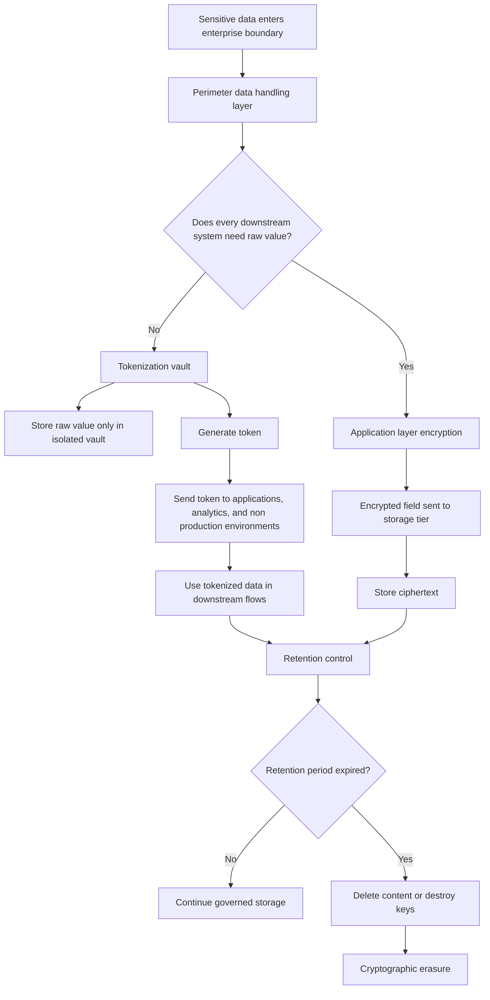

### Confidential computing and attestation

For especially sensitive workflows, negative space extends into runtime itself. Code and memory can operate inside hardware-protected boundaries, and decryption keys can be released only if the runtime proves its integrity.

> This view is shows negative space extends into runtime trust and data-in-use protection.

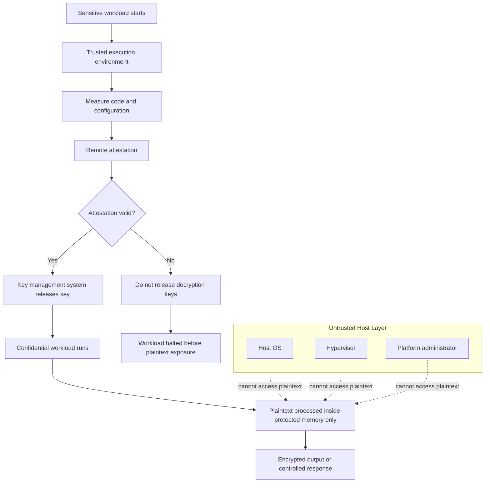

## Data contracts and structural ingress control

One of the key lessons from software engineering is that systems become more resilient when contracts are enforced at their boundaries. Negative-space thinking extends this principle into security architecture.

Rather than allowing anything in and relying on downstream controls to sort it out later, a well-designed API or ingestion layer validates, constrains, and rejects inputs that do not meet defined expectations. This reduces complexity throughout the system and eliminates entire classes of security and operational risk.

In a mature architecture, the boundary defines what is allowed, and anything outside that contract is treated as a failure of policy, not a case for special handling.

Rejected conditions typically include:

* unexpected fields
* invalid lengths
* wrong character classes
* missing required values
* nulls where business logic does not allow them
* malformed structures
* abuse patterns that resemble injection or parser manipulation

In security terms, this relates to:

* schema validation
* strict typing
* input validation
* API gateway policy
* contract enforcement
* payload sanitization

This is not just defensive coding, but it is boundary design. If the perimeter is strict, invalid input becomes a rejected event with clear meaning. If the perimeter is loose, ambiguity spreads into application logic, storage, telemetry, and operations. **Malformed input should be stopped at the perimeter before it becomes internal truth.**

> This diagram captures the fail-fast perimeter model where malformed or unexpected payloads are rejected before they spread.

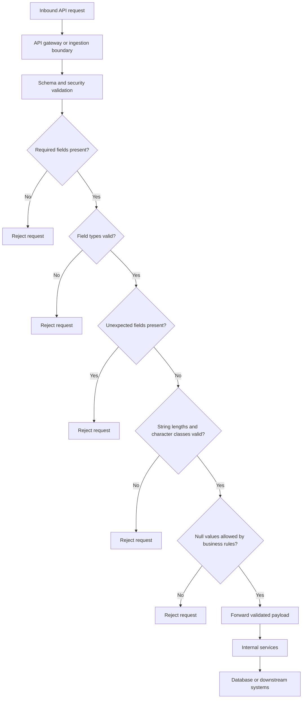

## Network security and zero trust boundaries

Networks often reveal the difference between conventional security thinking and negative space design most clearly. Traditional models tend to define zones and then inspect for suspicious movement between them. Negative space network architecture starts with a stronger assumption that **any communication path that is not explicitly required should not exist.**

Not merely be logged, discouraged or blocked by a broad outer firewall while still existing conceptually in the design. It should be absent from the allowed graph and denied as close as possible to the workload.

This maps cleanly to concepts such as:

* Zero Trust segmentation
* micro-segmentation
* identity-based networking
* default deny
* service mesh policy
* mutual TLS
* private subnet design
* egress filtering
* DNS control

Examples of negative space network constraints include:

* application servers cannot initiate arbitrary internet access
* web services cannot reach databases unless explicitly required
* workloads cannot resolve public domains unless there is a clear business reason
* east-west traffic is denied by default
* administrative access is separate from application paths
* production and non-production traffic do not mix
* only authenticated reverse proxies expose approved routes

This does more than reduce attack surface. It changes the economics of compromise. A compromised workload without unrestricted outbound access, unrestricted DNS, or broad lateral adjacency is far less useful to an attacker. That is a textbook example of negative space. The architecture does not attempt to defend every possible path. It removes many of those paths from existence.

> This diagram shows the intended flow graph and the omitted paths that should not exist.

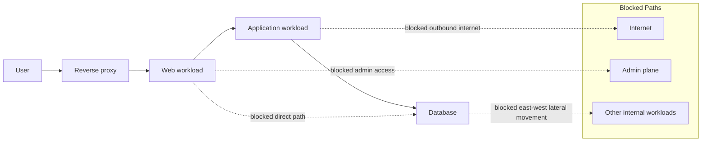

## Outbound egress and exfiltration resistance

Traditional data loss prevention often tries to inspect content as it leaves the environment. That can be valuable, but it is difficult to perfect and often suffers from both noise and blind spots.

If we ask question **Should the path required for unauthorized outbound movement exist at all?** Answer may lead to design decisions such as:

* workloads without a default internet route
* internal services forced through tightly scoped outbound proxies
* DNS resolution restricted to approved internal services
* no direct write access to external storage unless there is a defined business need
* workload-specific routing rather than broad shared egress

The advantage is that exfiltration becomes physically harder, not merely logically discouraged. This is a powerful example of architecture as omission. Instead of trying to detect every possible exfiltration pattern, the platform removes much of the capability that would make such behavior easy.

> Egress control and exfiltration resistance

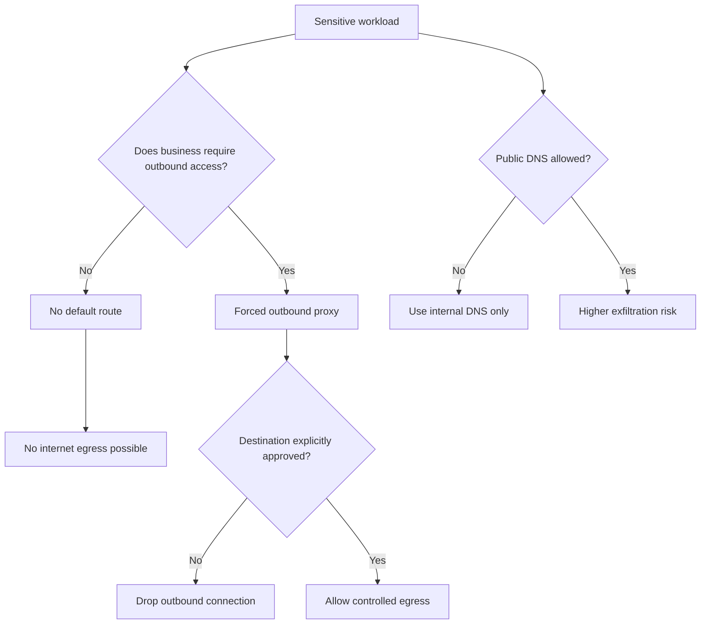

## Artificial intelligence and autonomous systems

AI systems, copilots, retrieval flows, and autonomous agents introduce a new reason to think in negative space. These systems can be useful, but they are probabilistic. They generate plausible outputs, not guaranteed truth, safe intention, or authorized action.  That means the surrounding architecture must define what the model or agent must never be able to do.

Examples include:

* access unrestricted internal systems
* write to production systems by default
* execute commands based only on natural language output
* retain sensitive data longer than needed
* move data silently across trust boundaries
* act outside an approved scope
* bypass deterministic validation layers

This relates directly to familiar AI governance patterns such as:

* guardrails
* sandboxing
* tool use restrictions
* output validation
* human approval workflows
* data minimization
* redaction and de-identification
* policy enforcement around model actions

The architectural lesson is that a language model can suggest, classify, summarize, or recommend. It should not become an execution authority just because its output sounds reasonable. In negative space terms **no AI output should become action unless it passes a deterministic, scoped, and auditable control layer.**

> Diagram shows how model output must pass an independent control layer before action.

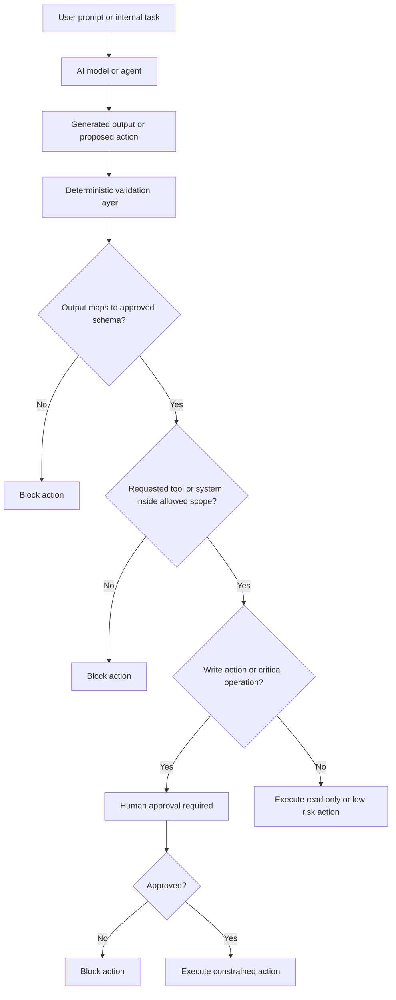

## Fail fast and the security circuit breaker

One of the standard objections to fail-fast design is that strict boundaries can interrupt legitimate flows. The same is true in security architecture. A hard boundary may terminate a session, reject a deployment, block a request, or isolate a service interaction that someone expected to continue. This is a real trade-off and should not be denied.

However, the alternative is often worse. Without meaningful early failure, unsafe conditions may evolve into:

* silent corruption
* partial compromise
* difficult forensic reconstruction
* low-fidelity alert storms
* delayed incident detection
* expensive cross-layer cleanup

A useful architectural metaphor here is the **security circuit breaker**. When a critical assumption no longer holds, the system should not just record the event and continue. It should reject, revoke, isolate, quarantine, or otherwise stop propagation.

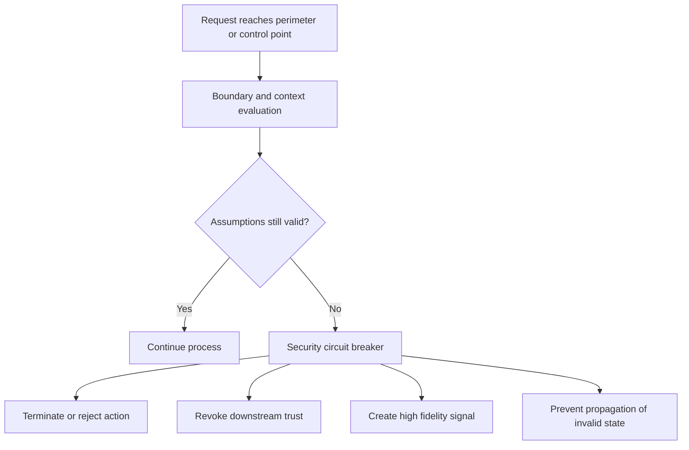

Without a functional fail path, a boundary is advisory rather than architectural. Negative space therefore requires organizations to think carefully about fail behavior. In some cases rejection is appropriate. In others, degraded operation, quarantine, or scoped isolation may be better. What matters is that the invalid state does not continue unchecked.

## Monitoring and signal quality

In poorly bounded environments, monitoring often compensates for architectural ambiguity. Security teams are forced to interpret huge volumes of noisy telemetry because too many unsafe or ambiguous states are allowed to exist in the first place.

In a negative space environment, monitoring becomes sharper because invalid states are already constrained. That improves signal quality in several ways:

* alerts map to explicit policy violations
* rejected actions have clear architectural meaning
* invalid states occur less often, making them more valuable
* fewer ambiguous conditions reduce triage complexity

Examples of meaningful signals include:

* a rejected deployment to an unapproved region
* a session revoked due to device posture failure
* a blocked east-west network flow that should never exist
* an unsigned artifact denied at runtime
* a malformed payload rejected at ingress

This is operationally significant. Monitoring becomes less about guessing whether an event matters and more about responding to boundary violations that already have design context behind them.

## Positive vs negative space by domain

| Domain                                 | Positive space, what is allowed or intended                                                          | Hidden assumptions                                                                                                          | Negative space, what must be impossible                                                                                                                                  | Earliest control point                                                    | Typical fail action                                                       | Representative controls and patterns                                                                                         |
| -------------------------------------- | ---------------------------------------------------------------------------------------------------- | --------------------------------------------------------------------------------------------------------------------------- | ------------------------------------------------------------------------------------------------------------------------------------------------------------------------ | ------------------------------------------------------------------------- | ------------------------------------------------------------------------- | ---------------------------------------------------------------------------------------------------------------------------- |
| Identity and access management         | Users, admins, and services authenticate and access systems according to approved roles              | Credentials are genuine, device is healthy, session context remains trustworthy, privilege is justified                     | Access from unmanaged or unhealthy devices, impossible travel, long-lived privileged sessions, legacy authentication bypass, uncontrolled privilege escalation           | Identity provider, conditional access layer, PAM workflow                 | Reject login, revoke token, require reauthentication, block elevation     | Continuous Access Evaluation, device posture checks, Just-in-Time access, Zero Standing Privileges, legacy protocol blocking |
| API and ingress                        | Applications and partners send requests through approved interfaces and receive valid responses      | Payload is well formed, schema is correct, client behavior is expected, context is authentic                                | Malformed payloads entering the system, unexpected fields, injection patterns, oversized requests, invalid content types                                                 | API gateway, ingress proxy, schema validation layer                       | Reject request, throttle client, quarantine message                       | Schema validation, input validation, API gateway policy, request size limits, sanitization                                   |
| Cloud and platform engineering         | Teams deploy infrastructure through approved templates, services, and regions                        | Templates are trusted, deployment path is controlled, encryption and logging are enabled by default                         | Public storage without approval, public database exposure, deployment in unapproved regions, unencrypted resources, logging disabled, unmanaged infrastructure           | IaC pipeline, policy engine, cloud governance layer                       | Fail deployment, deny resource creation, auto-remediate or isolate        | Landing zones, Policy as Code, service control policies, guardrails, admission control                                       |
| DevSecOps and software delivery        | Software is built, tested, signed, approved, and deployed through controlled pipelines               | Build pipeline is trusted, artifact provenance is known, runtime configuration remains bounded                              | Unsigned artifacts running in production, deployment outside approved pipelines, unverified provenance, critical unresolved issues bypassed, mutable production releases | CI/CD pipeline, artifact registry, runtime admission controller           | Break build, deny promotion, reject runtime admission                     | Artifact signing, provenance verification, break-the-build thresholds, immutable delivery, runtime hardening                 |
| Runtime and workload execution         | Approved workloads run with defined permissions and expected runtime behavior                        | Runtime identity is valid, permissions are scoped, workload cannot arbitrarily alter platform state                         | Excessive permissions, privilege escalation, writable root filesystem, runtime drift, unauthorized sidecar or tool execution                                             | Admission controller, orchestrator policy, workload runtime guard         | Block startup, kill workload, isolate namespace or host                   | Kubernetes admission control, read-only root filesystem, least privilege runtime, seccomp/AppArmor style controls            |
| Data security                          | Applications process and store only the data necessary for approved business purpose                 | Data classification is known, receiving environment is approved, retention rules exist and are followed                     | Sensitive data in test environments, unnecessary duplication, plaintext exposure where not required, excessive retention, uncontrolled sharing                           | Application boundary, tokenization layer, KMS boundary, data access layer | Reject transfer, tokenize, encrypt, delete, quarantine dataset            | Data minimization, tokenization, application-layer encryption, field-level encryption, retention control                     |
| Data ingestion and contracts           | Systems accept structured input that matches business and technical expectations                     | Producers follow contract, fields are complete, format is exact, downstream systems should not reinterpret data ambiguously | Missing required fields, invalid data types, uncontrolled payload variations, business-invalid values, parser confusion                                                  | Ingestion layer, message broker validation, API contract layer            | Reject message, dead-letter queue, quarantine record                      | Contract enforcement, strict typing, payload validation, schema registry                                                     |
| Network security                       | Workloads communicate only along defined, required paths                                             | Allowed paths are known, workload identity is meaningful, segmentation rules reflect actual need                            | Unapproved east-west traffic, arbitrary outbound internet access, direct database reachability, broad flat network adjacency, unrestricted DNS usage                     | Network policy engine, service mesh, firewall, segmentation layer         | Drop connection, reset flow, isolate segment                              | Micro-segmentation, default deny, identity-based networking, mutual TLS, private subnet design                               |
| Egress and outbound control            | Systems communicate externally only where there is a clear business need                             | Outbound destinations are known, DNS behavior is controlled, proxy path is enforced                                         | Unrestricted outbound communication, uncontrolled data transfer destinations, direct exfiltration routes, DNS-based tunneling paths                                      | Egress proxy, DNS control point, network boundary                         | Block route, deny resolution, force proxy, quarantine host                | Egress filtering, proxy allow lists, DNS filtering, workload-specific routing                                                |
| Secrets and key management             | Applications and services retrieve secrets and keys through approved mechanisms                      | Secret use is short-lived, retrieval identity is trustworthy, keys are scoped to purpose                                    | Hard-coded secrets, long-lived static credentials, direct secret sharing, uncontrolled key export, broad decryption access                                               | Secret store, KMS, workload identity layer                                | Deny secret retrieval, rotate credential, revoke key access               | Managed secrets, KMS policies, workload identity, key scoping, short-lived credentials                                       |
| Endpoint and device trust              | Managed devices access enterprise resources under expected security posture                          | Device is enrolled, encrypted, patched, compliant, not tampered with                                                        | Access from unmanaged devices, encryption disabled, unhealthy endpoint posture, unsupported OS, broken compliance agent                                                  | Device compliance platform, MDM, access policy engine                     | Block access, require remediation, restrict to low-trust access path      | Device compliance, posture assessment, conditional access, attestation                                                       |
| Logging, monitoring, and telemetry     | Systems emit logs and security events that support visibility and response                           | Signals are trustworthy, coverage exists at boundaries, invalid states are meaningful and rare                              | Low-fidelity noise dominating monitoring, blind spots at critical boundaries, invalid states undetected, logs disabled on sensitive paths                                | Logging pipeline, SIEM intake, control point telemetry                    | Raise high-confidence alert, block if logging is absent on mandatory path | High-fidelity eventing, boundary telemetry, control evidence, mandatory logging policies                                     |
| AI and autonomous systems              | AI assists with analysis, summarization, retrieval, and controlled action support                    | Model output is not inherently trustworthy, tool use is bounded, sensitive data exposure is controlled                      | AI acting directly without validation, access to unrestricted internal systems, sensitive data over-retention, unscoped tool use, autonomous destructive action          | AI policy layer, tool broker, execution wrapper                           | Block action, require human approval, redact, sandbox                     | Guardrails, output validation, sandboxing, human approval workflows, scoped tool permissions                                 |
| Third-party and integration boundaries | External vendors, partners, and SaaS platforms exchange approved data and invoke approved interfaces | Integration scope is clearly defined, trust is limited, third-party behavior is observable                                  | Excessive partner access, uncontrolled data sharing, unmanaged API paths, broad network trust to third parties                                                           | Federation boundary, API gateway, vendor access layer                     | Deny connection, revoke integration token, restrict exchange scope        | Least privilege federation, partner segmentation, scoped APIs, contractual control enforcement                               |
| Administrative access and operations   | Operators maintain systems through approved workflows and support channels                           | Admin actions are attributable, time-bound, approved, and separated from standard user activity                             | Shared admin accounts, permanent production admin rights, direct unmanaged access, break-glass abuse, unlogged admin actions                                             | PAM layer, bastion, privileged workflow engine                            | Deny elevation, close session, require approval, enforce recording        | Privileged access management, JIT admin, session recording, bastion access, approval workflows                               |
| Resilience and recovery paths          | Backup, restore, failover, and recovery functions preserve business continuity                       | Recovery paths are secure, backup data is protected, recovery identities are constrained                                    | Recovery environment as a security bypass, unprotected backups, unrestricted restore actions, stale privileged recovery credentials                                      | Backup platform, recovery orchestration, KMS boundary                     | Deny restore, require dual approval, isolate recovery zone                | Backup encryption, recovery approval workflows, isolated recovery environments, vaulted credentials                          |

## Bringing the Architectural Model Together

Negative space in enterprise security architecture is best understood as a design discipline that shifts attention from permitted functionality to forbidden states.

Borrowed from software engineering, it encourages architects to define the absence of unsafe behavior as deliberately as they define valid business workflows. That changes the security conversation.

Instead of focusing only on:

* what should be allowed
* what controls should be added
* what should be monitored
* how exceptions should be handled later

it also asks:

* what assumptions must hold
* what conditions must invalidate trust
* what paths should not exist
* what states should be undeployable
* what capabilities should simply not be present

This perspective is useful in modern enterprise environments, where complexity, scale, platform flexibility, and probabilistic technologies like AI all increase the cost of ambiguity.

When applied well, negative space does more than improve security. It produces clearer systems. Threat models become sharper. Assumptions become visible. Platform variance decreases. Monitoring becomes more meaningful. Recovery becomes more localized. Auditability improves. Engineering discussions become more precise because the architecture stops pretending that unsafe possibilities are merely operational details.

In the end, a secure architecture should not only permit the right things. It should also define, with equal seriousness, what the system **refuses to become**.

---

# From Design Principle to Organizational Capability

## Operating model

Controls becomes meaningful only when they are owned, enforced, and maintained as part of how the organization actually operates. Without a clear operating model, even well-designed architectural constraints will drift over time, accumulate exceptions, or be inconsistently applied across platforms and teams.

This section extends the concept from design into execution by clarifying accountability, decision rights, and lifecycle management.

### Who defines invalid states

Invalid states should not be defined ad hoc or only within isolated technical teams. They must be derived from a combination of security risk, business criticality, and architectural intent.

In practice, this responsibility typically sits with **architecture and security leadership**, working closely with platform teams and domain owners. Enterprise or domain architects translate business risks into architectural constraints, while security practitioners ensure that threat scenarios and regulatory expectations are reflected.

However, definition should not be purely centralized. Domain teams contribute by identifying realistic operating conditions, dependency patterns, and failure modes. This prevents overly rigid definitions that do not reflect how systems are actually used.

A useful model is:

* central architecture and security define **principles and critical invalid states**
* platform teams translate them into **enforceable controls**
* domain teams validate them against **real workflows and edge cases**

The outcome should be a shared understanding of what the system must never allow, expressed in a form that can be technically enforced.

### Who approves exceptions

Exceptions are inevitable, but without discipline they become the dominant operating model. Exception approval must therefore be **explicit, time-bound, and owned**. It should not be left to informal agreements or local decisions within delivery teams.

Typically:

* **risk owners or business owners** approve the necessity of the exception
* **security or architecture** validates the impact and defines compensating controls
* **platform or engineering teams** implement and track the exception

Each exception should include:

* a clear business justification
* defined scope and affected systems
* compensating controls if full enforcement is not possible
* an expiry or review date
* traceability for audit and review

This ensures that exceptions remain visible and temporary, rather than silently redefining the architecture.

### Who owns control plane dependencies

Negative space relies heavily on control planes such as identity providers, policy engines, CI/CD pipelines, admission controllers, key management systems, and network enforcement layers.

These components must have **clear ownership and product-level responsibility**. They are not just shared services. They are part of the security-critical infrastructure of the organization.

Ownership typically sits with **platform engineering or dedicated teams**, with responsibilities including:

* availability and resilience
* policy consistency and version control
* integration with dependent systems
* observability and troubleshooting
* controlled rollout of changes

Because many architectural decisions converge in these control planes, they must be treated as high-value assets. Weak ownership here undermines the entire negative space model.

### How boundaries are versioned and tested

Architectural boundaries and policies should not be static or implicit. They must be treated as **versioned artifacts**, similar to code and infrastructure.

This includes:

* policy definitions
* access rules
* schema contracts
* deployment constraints
* network segmentation rules

Versioning allows controlled evolution, rollback, and traceability of changes. It also helps align different environments and reduce drift.

Testing is equally important. Boundaries should be validated not only in theory but through **systematic testing**, such as:

* policy tests in CI/CD pipelines
* simulation of invalid states and expected rejection
* integration testing across control and data planes
* periodic validation of fail modes and fallback behavior

The goal is to ensure that the architecture behaves as intended, especially under edge conditions, not only during ideal operation.

### How business leadership participates in trade-off decisions

Negative space introduces real trade-offs. Stronger prevention can affect usability, flexibility, performance, and availability. These trade-offs cannot be resolved purely within technical teams. **Business and executive leadership must participate in defining acceptable boundaries.**

Their role includes:

* prioritizing which risks justify strict prevention
* accepting or rejecting trade-offs between control and agility
* supporting standardization across teams
* backing enforcement decisions when they create friction
* aligning architectural constraints with business strategy and regulatory expectations

This is important in areas such as:

* restricting data movement
* limiting production access
* enforcing controlled deployment paths
* introducing approval steps for high-impact actions

When leadership is engaged, secure architecture becomes an organizational choice, not just a technical preference. Without that support, controls may be bypassed or weakened over time. In practice, the effectiveness of negative space depends less on the number of controls defined and more on the **clarity of ownership, discipline of exception handling, and reliability of control planes**. A well-designed architecture must be supported by an equally well-defined operating model, or it will gradually revert to flexibility without boundaries.

## Prioritization

Negative space is a powerful design principle, but it should not be applied uniformly or all at once. In most enterprise environments, the goal is not to eliminate every possible unsafe state immediately, but to **prioritize areas where invalid states create the highest risk, widest blast radius, or hardest recovery burden**.

A pragmatic approach is to start where a single failure can propagate quickly across systems, undermine trust relationships, or expose critical assets. In these areas, making unsafe states structurally impossible produces disproportionate value.

### Identity and session trust

Identity is often the highest leverage control point because it sits at the beginning of most interactions. If identity boundaries are weak, other controls inherit that weakness. A compromised credential with broad or persistent access can bypass layered defenses and move across systems. Negative space should therefore be applied early to:

* prevent unmanaged or untrusted devices from establishing sessions
* eliminate long-lived tokens and persistent session trust
* remove legacy authentication methods and fallback paths
* ensure privileged access cannot exist without time-bound approval

Improving identity invalid states typically reduces risk across many downstream systems at once.

### Privileged access and administrative control

Privileged access defines the upper bound of what a compromised identity or insider can do. In many organizations, the most damaging scenarios involve over-permissioned accounts, standing administrative rights, or weak separation between operational and administrative paths. High-priority constraints include:

* no permanent administrative privileges in sensitive environments
* no direct administrative access from user workstations
* no privilege escalation without explicit approval and expiry
* no shared or untraceable privileged accounts

Applying negative space here directly limits blast radius and reduces the likelihood of systemic compromise.

### Deployment path to production

The pathway into production is one of the important control points in modern environments. If untrusted or unverified artifacts can reach production, other controls become secondary. Priority should be given to making it impossible for production to run anything that did not pass through a trusted and governed process.
Key constraints include:

* no unsigned or unverified artifacts in production
* no deployments outside approved CI/CD pipelines
* no manual bypass of policy gates
* no workloads without defined provenance and traceability

This ensures that the system enforces trust in how software is created and delivered, not only how it behaves at runtime.

### Sensitive data egress

Data leaving the environment is often irreversible. Unlike many other security failures, data exfiltration cannot easily be undone. By constraining egress paths, the architecture reduces both intentional and unintentional data exposure. Negative space should therefore focus on removing unnecessary outbound capability:

* no default internet access from sensitive workloads
* no unrestricted DNS resolution
* no ability to send data to unapproved destinations
* no uncontrolled export from high-value data stores

### Internet exposure of critical assets

Public exposure of internal systems increases attack surface and often becomes the initial entry point for attackers. Reducing exposure simplifies threat models and removes entire classes of attack paths. High-impact constraints include:

* no direct internet exposure of internal databases or back-end services
* no public endpoints without explicit architectural approval
* no unmanaged or unmonitored externally reachable assets
* no mixing of administrative and public access paths

### AI write-capable and high-impact actions

The highest priority is not restricting read or advisory use, but ensuring that **AI-generated output cannot directly cause impactful changes without control**. This prevents probabilistic systems from becoming unbounded execution authorities.

Key constraints include:

* no direct execution of model output without validation
* no write access to production systems by default
* no autonomous action outside a defined scope
* mandatory approval or control layers for high-impact operations

In practice, prioritization should follow a simple principle. **Start where unsafe states can propagate widely, act with high privilege, or cause irreversible impact.** These areas tend to define the real risk profile of the organization. By applying negative space first at these critical boundaries, the architecture achieves meaningful risk reduction early, while creating a foundation for broader, more consistent enforcement across other domains.

## A staged adoption model

Negative space should be introduced deliberately. Attempting to define and enforce all invalid states at once often leads to disruption, resistance, or uncontrolled exception growth. A staged approach allows the organization to build understanding, validate assumptions, and progressively increase enforcement while maintaining operational stability. The following model outlines a practical path from concept to embedded architectural discipline.

### Make hidden assumptions visible

The first step is not enforcement, but visibility. Most enterprise environments already rely on implicit assumptions about identity, data flows, infrastructure, and behavior. These assumptions are often undocumented, inconsistently understood, and weakly enforced.

At this stage, the goal is to:

* identify critical business capabilities and supporting systems
* surface implicit trust assumptions and dependencies
* map where decisions are currently made and where they are deferred
* highlight areas where invalid states are tolerated or handled late

Workshops, architecture reviews, and threat modeling are effective tools here. The outcome is a clearer picture of where ambiguity exists and where structural gaps may lead to risk.

### Define critical invalid states

Once assumptions are visible, the next step is to **define what must not be allowed**, focusing on the most important scenarios.

This is not about completeness. It is about clarity and impact.

Teams should identify:

* high-risk states that could lead to broad compromise
* conditions that undermine trust in identity or data
* unsafe deployment or operational patterns
* data movement that creates irreversible exposure

Examples might include:

* production workloads running from untrusted sources
* persistent privileged access without approval
* sensitive data leaving governed environments
* uncontrolled internet exposure of internal systems

At this stage, invalid states should be clearly described, agreed upon, and documented in a way that can later be translated into enforceable controls.

### Enforce at key boundaries

With a defined set of critical invalid states, enforcement begins.

The focus should be on **early, high-leverage control points**, not widespread or fragmented control deployment.

Typical starting points include:

* identity and access policies
* CI/CD pipelines and deployment paths
* API gateways and ingestion layers
* cloud governance and platform guardrails
* network segmentation and egress control

At this stage:

* enforcement should be automated wherever possible
* fail behavior should be explicit and consistent
* monitoring should capture both allowed and rejected actions

Initial enforcement may be partial or scoped, but it must be real. The goal is to establish that invalid states are not just defined, but actively rejected.

### Reduce exception volume

Once enforcement begins, exceptions will surface quickly. This is expected and often valuable, as it reveals mismatches between architecture and real-world usage. However, unmanaged exceptions can quickly erode the model. Over time, the architecture should evolve so that fewer exceptions are required. A decreasing dependency on exceptions is a key indicator of maturity.

The objective at this stage is to:

* track and categorize exceptions clearly
* identify patterns behind recurring exceptions
* refine definitions where they are overly rigid
* adjust systems or processes to reduce the need for exceptions
* enforce expiry and review of temporary approvals

### Make negative space measurable and auditable

The final stage is to treat negative space as a **measurable architectural property**, not just a design intention. This involves:

* defining metrics for coverage and effectiveness
* tracking how many critical invalid states are enforced structurally
* measuring reduction in unsafe configurations or behaviors
* monitoring rejection events as meaningful signals
* providing evidence for audits and governance processes

Examples of useful indicators include:

* proportion of production changes through trusted pipelines
* percentage of privileged access that is time-bound
* reduction in internet-exposed sensitive assets
* volume and age of active exceptions
* frequency and type of rejected invalid states

At this stage, negative space becomes part of how the organization demonstrates control, not only how it designs systems.

This staged model allows organizations to move from **awareness to enforcement to measurable discipline**, without requiring unrealistic transformation upfront.

The key principle is progression:

* first understand assumptions
* then define boundaries
* then enforce selectively
* then stabilize by managing exceptions
* finally, make the model visible and accountable

Through this approach, negative space evolves from an architectural idea into a sustained capability embedded in both technology and organizational practice.

## Securing Legacy Systems Through Compensating Controls

One of the most common objections to negative space architecture is that many enterprise environments contain systems that cannot easily be changed. Legacy applications, industrial control systems, commercial off-the-shelf products, embedded platforms, and business-critical workloads may lack support for modern identity controls, strong encryption, segmentation-aware architectures, software supply chain verification, or contemporary security instrumentation.

In these environments, the goal is not immediate elimination of unsafe states. The goal is to **reduce the impact and probability of unsafe states through compensating controls placed around the system**.

Negative space remains useful because it shifts the question from: _How do we secure this legacy system?_ to: _Which unsafe states can we still make impossible even if the system itself cannot be changed?_

The architecture therefore focuses on constraining the environment surrounding the legacy asset rather than modifying the asset itself.

### The principle of control relocation

When a control cannot be implemented inside a system, it should be moved outward to the earliest location where enforcement remains possible. The objective is not perfection. The objective is preventing uncontrolled exposure despite technological limitations.

| Missing capability in legacy system | Compensating control location         |
| ----------------------------------- | ------------------------------------- |
| No MFA support                      | Identity provider or access gateway   |
| No modern authentication            | Federation proxy                      |
| No encryption support               | Enterprise network encryption gateway |
| No fine-grained authorization       | Reverse proxy or API gateway          |
| No logging capability               | Network telemetry and monitoring      |
| No input validation                 | Ingress filtering layer               |
| No patching capability              | Segmentation and isolation controls   |
| No EDR support                      | Network behavior monitoring           |
| No modern protocol support          | Protocol translation gateway          |

### Security onion around legacy assets

Legacy systems often require a different architectural approach. Instead of embedding controls directly in the workload, controls are layered around it.

Typical protective layers may include:

* dedicated network segmentation
* micro-perimeters
* jump hosts and bastion systems
* privileged access workflows
* application proxies
* monitoring and anomaly detection
* egress restrictions
* protocol filtering
* allow-listed communication paths

The fewer assumptions that rely on the legacy system itself, the stronger the overall architecture becomes.

### Prioritizing Compensating Controls
  
Not every weakness in a legacy system requre the same level of investment. In many cases, trying to fix every deficiency at once consumes significant effort while delivering only marginal risk reduction. A more effective approach is to focus first on controls that reduce the probability and impact of the most consequential failure scenarios.

The starting point should usually be exposure. Before considering vulnerabilities, authentication mechanisms, or monitoring tools, it is worth asking a simpler question _Who can actually reach the system?_

Reducing exposure often delivers the greatest security benefit for the least effort. Legacy platforms that can only be reached through tightly controlled pathways are  less risky than those broadly accessible across the network. High-value measures typically include:

* removing unnecessary internet exposure
* restricting connectivity to approved sources
* separating administrative and user access paths
* eliminating unnecessary trust relationships
* introducing network segmentation

Once exposure has been reduced, attention should shift to identity. Many legacy systems lack support for modern authentication methods, contextual access decisions, or strong session management. While these capabilities may not be achievable within the application itself, they can often be enforced around it.

Useful compensating controls include:

* access gateways and authentication proxies
* upstream MFA enforcement
* privileged access management
* managed-device requirements
* session monitoring and recording
  
The goal is to modernize trust decisions around the system, even when the system itself remains unchanged.

It is equally important to consider what happens if the system is eventually compromised. Security architecture should assume that prevention will never be perfect and focus on limiting the consequences of failure. The question becomes _if the system is compromised, what can an attacker do next_?

The effective controls are those that constrain movement beyond the initial compromise:
* east-west segmentation
* workload isolation
* egress restrictions
* DNS controls
* explicit allow-listing of permitted communications  

Rather than attempting to guarantee that compromise never occurs, these controls focus on reducing blast radius and preventing a localized incident from becoming an enterprise-wide problem.

Attention should then turn to the information the system processes. In many environments, the risk lies not in the application itself but in the data it contains. Organizations often achieve more meaningful risk reduction by protecting data around a legacy platform than by attempting to harden the platform directly.

Potential measures include:
* data minimization
* tokenization
* encryption gateways
* strict export controls
* reduced retention periods

The objective is to reduce both the amount of sensitive data available and the number of locations where that data can exist. In practice, protecting the data often delivers greater value than trying to modernize an application that cannot realistically be changed.

Finally visibility, while monitoring is primarily detective rather than preventive, it becomes increasingly important when stronger controls cannot be implemented. Organizations should be able to answer a question _How quickly would we know if something went wrong?_

Strong visibility typically relies on:
* network telemetry
* behavioral analytics
* protocol monitoring
* privileged session recording
* centralized logging  

These capabilities provide the evidence needed to detect misuse, investigate incidents, and validate that compensating controls are functioning as intended.
The objective is not to make the legacy system perfect. It is to progressively reduce the number of unsafe states that the surrounding architecture permits. The most valuable compensating controls are therefore those that reduce exposure, strengthen trust decisions, constrain propagation, limit data availability, and increase visibility into the risks that remain.

### A risk-based prioritization model

Legacy system mitigation efforts should be driven by a combination of business impact and technical exposure. The highest-priority candidates typically exhibit several of the following characteristics:

* internet accessible
* processes sensitive data
* supports critical business processes
* provides privileged access
* has known vulnerabilities
* cannot be patched
* has broad network connectivity
* lacks monitoring
* lacks strong authentication

These systems should receive compensating controls before attention is directed toward lower-risk assets.

## How do you know that architecture is improving

Negative space is valuable only if it produces observable change. Without measurement, it remains a conceptual preference rather than a demonstrable capability. Leaders and program owners therefore need a way to assess whether the architecture is becoming more constrained, more consistent, and more resilient over time. The goal is not to measure activity, such as how many controls exist, but to measure **how effectively unsafe states are prevented, how consistently boundaries are applied, and how much reliance on reactive handling is reduced**.

### Coverage of enforced boundaries

A primary indicator of progress is how much of the environment is actually governed by preventive constraints.

Relevant signals include:

* proportion of production workloads deployed only through trusted pipelines
* percentage of identities subject to contextual access evaluation
* percentage of critical assets behind enforced network segmentation
* share of APIs protected by strict schema validation at ingress
* extent of workloads without direct internet egress

This reflects whether efective security is applied selectively or embedded as a systemic property.

### Reduction of unsafe states in the environment

Another measure is whether unsafe or undesired configurations are decreasing over time. Examples include:

* reduction in publicly exposed sensitive assets
* reduction in resources without encryption or logging
* reduction in long-lived privileged accounts
* reduction in unmanaged or ungoverned workloads
* reduction in untracked or legacy authentication methods

The direction of change is more important than the absolute number. A stable or rising count often indicates that enforcement is incomplete or bypassed.

### Strength of preventive enforcement

It is usefull to distinguish between states that are detected and states that are **blocked or made impossible**. Indicators of strong enforcement include:

* percentage of critical controls implemented as preventive rather than detective
* number of invalid states rejected before execution
* proportion of deployment failures caused by policy enforcement rather than runtime detection
* existence of hard technical barriers instead of advisory controls

This reflects whether the architecture is shifting from observation to structural prevention.

### Exception volume and lifecycle

Exceptions provide a direct signal of architectural maturity. A high or growing volume of exceptions often indicates misalignment between design and reality. Useful measures include:

* number of active exceptions in critical domains
* average age of exceptions
* percentage of exceptions with defined expiry and review
* recurrence of similar exception types

Over time, a mature architecture should show:

* fewer exceptions overall
* shorter-lived exceptions
* fewer repeated exception patterns

This indicates that the platform and operating model are adapting to reduce the need for bypasses.

### Quality and meaning of security signals

Negative space improves the meaning of telemetry. Events should increasingly represent real boundary violations rather than ambiguous anomalies. Indicators include:

* proportion of alerts tied to explicit policy violations
* reduction in low-value or ambiguous alerts
* clarity of root cause for rejected actions
* time required to triage and understand security events

The aim is not only fewer alerts, but **more interpretable and actionable signals**.

### Control plane reliability and consistency

As more decisions move into control planes, their reliability becomes critical.

Measures may include:

* availability and latency of identity, policy, and admission services
* consistency of policy enforcement across environments
* frequency of control plane misconfigurations or failures
* success rate of policy evaluation and enforcement operations

This ensures that increased centralization does not introduce fragility.

### Time to detect and contain invalid states

Even with strong prevention, some invalid conditions will occur. The architecture should enable faster identification and containment. Indicators include:

* time from invalid state occurrence to detection
* time from detection to containment or rejection
* extent of propagation before containment
* scope of affected systems

A strengthening architecture should show **earlier detection and smaller blast radius**.

### Alignment with business risk priorities

Finally, progress should be evaluated in terms of business impact, not only technical coverage. This includes:

* reduction in scenarios that could cause high-impact incidents
* improved control over sensitive data movement
* stronger governance of production changes
* clearer evidence for audit and regulatory review

This connects architectural improvements to outcomes that matter to leadership. In practice, there is no single metric that proves success. What matters is a consistent pattern:

* more enforcement at earlier boundaries
* fewer unsafe states present in the environment
* fewer and better-governed exceptions
* clearer, higher-quality signals
* stronger alignment between architecture and actual system behavior

When these trends are visible, negative space is no longer theoretical. It becomes a measurable property of the system and a reliable foundation for both security and operational control.

---

# Apendix

## Framing and disclaimers

* This is a design discipline and thinking model, not a product, toolset, or prescriptive framework
* It should be used as a lens to challenge assumptions and structure decisions, not as a compliance checklist
* The goal is systematic reduction of unsafe states, not complete elimination of risk
* The approach does not replace monitoring and detection, but makes them more precise
* Some level of exceptions and flexibility will always exist, but should be minimized and controlled
* The method should be applied pragmatically where the platform can enforce it, not uniformly everywhere
* Outputs are intended to guide prioritization and architectural evolution, not immediate full enforcement

## Strategic benefits

For architects it forces hidden assumptions into explicit design decisions. That improves clarity, threat modeling, and the ability to reason about attack surface.

For engineers it reduces the spread of invalid states. Systems become easier to understand because boundaries and contracts are more precise.

For operations teams failures happen earlier and are easier to localize. This reduces ambiguity and often shortens recovery time.

For security teams controls become more demonstrable, signals become cleaner, and preventive architecture can reduce dependence on large volumes of weak detective telemetry.

For leadership supports consistency, standardization, auditability, and stronger evidence that the organization controls important architectural risks in a systematic way.

Perhaps most importantly, negative space improves discipline around assumptions. A large portion of enterprise weakness does not sit in visible policy. It sits in invisible assumptions shared imperfectly between architecture, engineering, operations, and governance. Negative space makes those assumptions visible enough to challenge and strong enough to enforce.

## Trade-offs and architectural limits

Negative space is powerful, but it is not free. The first trade-off is between **security and availability**. A strict fail-fast boundary may reject legitimate traffic if the contract is too narrow or if the implementation does not reflect real business variation. Applied carelessly, a protective control can become a self-inflicted outage.

There is also a **performance and complexity cost**. Continuous session evaluation, artifact signing, tokenization, attestation, encryption boundaries, and policy enforcement layers all introduce overhead.

A further challenge is dependence on **central control planes**. If many architectural decisions concentrate in identity services, policy engines, admission controllers, or key management systems, then those components become critical infrastructure. They must be resilient, observable, and treated accordingly.

Legacy estates are another constraint. Many older systems were not built to support contextual IAM, machine-readable contracts, strong segmentation, deterministic delivery paths, or modern cryptographic controls. In such cases, negative space may still serve as a design direction, but implementation may require compensating controls and staged modernization rather than immediate full enforcement.

Finally, negative space requires maturity. Organizations need at least reasonable visibility into assets, dependencies, identities, data flows, and business exceptions. If the enterprise does not understand what truly happens today, then strict enforcement can break undocumented but important operations.

That is why negative space should not be applied as a slogan. It is a design discipline. It works best when introduced deliberately, with visibility, phased rollout, and collaboration across architecture, engineering, operations, and business leadership.

## Assumptions, prerequisites, and limitations

* The organization has a working understanding of assets, identities, data flows, and trust boundaries

* There is sufficient engineering capability to enforce controls in code and automated platforms, not only in policies or documentation

* Visibility and observability exist at key control points to support validation and decision-making

* Systems, data, and control boundaries have clear ownership and accountability

* There is support for standardization and platform consistency, even at the cost of reduced local flexibility

* Security is treated as a design constraint embedded into architecture, not only as a downstream operational function

* Technology decisions consider operational complexity, cost, and long-term maintainability, not only feature capability

* Governance is actively enforced through real practices and decisions, not only formal structures

* The organization is able to define invalid states and identify early control points, at least for critical domains

* Prevention is prioritized over detection, but not assumed to be universally achievable

* Fail behavior is explicit by design (reject, revoke, isolate), not left implicit or inconsistent

* Trade-offs between security, availability, usability, and agility are consciously evaluated

* The approach is applied incrementally, not as a full or immediate redesign

* Different domains adopt controls at different speeds, depending on platform maturity

* Legacy systems may require compensating controls, rather than strict enforcement

* The environment supports collaboration across architecture, engineering, operations, and business teams

* Organizational factors such as incentives, culture, and change management are treated as critical enablers, not secondary concerns

* Systems are expected to operate under real-world conditions, including imperfect data, evolving requirements, and human interaction

* Architecture and security are evaluated in terms of overall system behavior, not only individual control effectiveness

* Central control components (identity, policy engines, key management) become critical dependencies and must be resilient

* Overly rigid or poorly designed controls can introduce availability risk or unintended disruption

## A practical design method for workshop

For architecture reviews and workshops, a simple method can make the concept very concrete.

### The business function

What is the system meant to do?

### The hidden assumptions

What conditions are silently assumed to be true for that function to remain safe?

### The invalid states

What surrounding states must never be allowed to occur?

Examples:

* data exits to unapproved destinations
* production admin access persists permanently
* unsigned code executes in production
* malformed payloads are accepted internally
* real personal data appears in testing

### The earliest control point

Where can the architecture reject the invalid state before it spreads?

Examples:

* identity provider
* API gateway
* deployment pipeline
* admission controller
* service mesh
* key management system
* tokenization boundary
* egress control layer

### The fail mode

Should the system reject, revoke, quarantine, isolate, or degrade gracefully?

### The evidence

What logs, alerts, metrics, or state changes prove the boundary worked?

### The trade-offs

What operational, performance, support, or availability cost does the control introduce?

| Step               | Key question                         | Example output                                    |
| ------------------ | ------------------------------------ | ------------------------------------------------- |
| Business function  | What must the system do?             | Payment processing, customer onboarding           |
| Hidden assumptions | What must be true for it to be safe? | Trusted device, correct schema, valid identity    |
| Invalid states     | What must never happen?              | Data leakage, malformed requests, permanent admin |
| Control point      | Where do we stop it early?           | IdP, API gateway, CI/CD pipeline, network layer   |
| Fail mode          | What happens on violation?           | Reject, revoke, isolate, quarantine               |
| Evidence           | How do we prove it worked?           | Logs, alerts, policy decision records             |
| Trade-offs         | What is the cost?                    | Latency, complexity, availability impact          |

## Diagrams

### Control Plane



This diagram expands the simplified control plane model by showing how policy decisions are formed and enforced in practice.

A subject (identity) initiates a request through a system (execution context). This combination is treated as untrusted and must be validated before accessing enterprise resources. The **policy enforcement point** intercepts the request and consults the **policy decision point**, which determines whether the state is valid.

The decision is not based on identity alone. It incorporates broader context from multiple inputs such as security posture, compliance, threat intelligence, and activity logs, as well as external systems like identity management and cryptographic trust services.

From a negative space perspective, the key idea is that decisions are driven not only by what is allowed, but also by identifying conditions that must invalidate the request. The control plane enforces these constraints early, ensuring that invalid states are rejected before they reach the data plane.

### Master Architecture Diagram

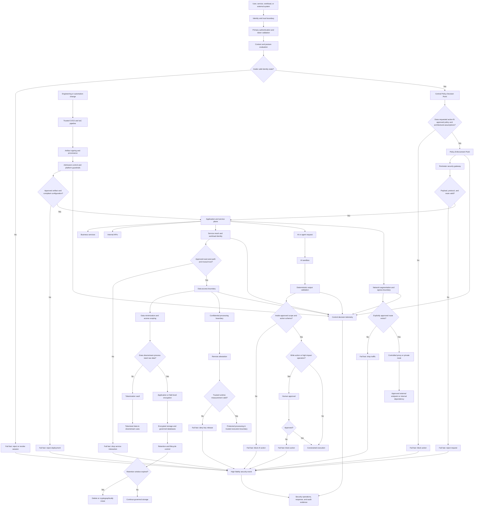

This diagram shows how negative space is enforced across the full request path.

A request begins at the identity boundary, where both authentication and context are validated. A valid credential alone is not enough. The system must remain inside acceptable conditions. If not, the request is rejected early.

The control plane then evaluates whether the requested action fits approved policy and architectural assumptions. Only valid requests proceed to the enforcement layer and into the processing path.

At each subsequent boundary, the same pattern repeats:

* **Ingress** enforces strict payload and protocol validation
* **Delivery and platform controls** prevent untrusted or non-compliant workloads from being deployed
* **Service and network layers** restrict communication to explicitly allowed paths
* **Data controls** reduce where sensitive data exists and prevent unnecessary exposure
* **AI components** validate outputs before any action and require approval for high-impact operations
* **Egress controls** ensure only approved outbound paths are possible

Invalid states are consistently rejected at the earliest point, and every rejection generates a high-quality signal for monitoring and response.

### Executive-focused master architecture diagram

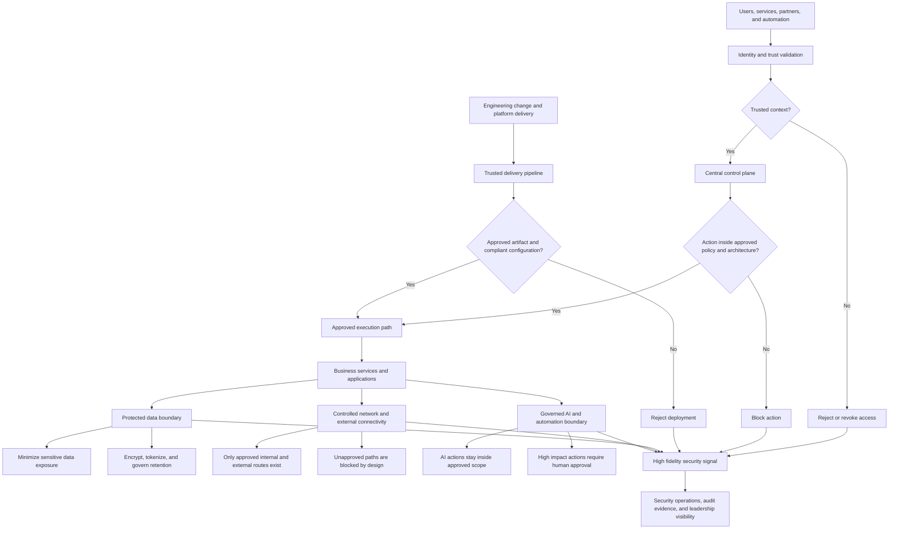

This diagram presents security as a set of strict, early decision points.

Every interaction starts with **identity and context validation**. Access is not granted based on credentials alone. If the surrounding conditions are not trustworthy, the request is rejected immediately.

A central control plane then determines whether the requested action fits approved policy and architecture. This is where negative space is applied. The system is explicitly designed to block actions that should never occur.

In parallel, **engineering change is treated with the same discipline**. Only trusted, verified, and compliant changes are allowed to reach production, preventing risk from entering through delivery.

Once inside the execution layer, boundaries remain tightly defined:

* **Data** is minimized, protected, and governed
* **Network paths** exist only where explicitly required
* **AI and automation** operate within controlled scope, with human approval for high-impact actions

## Glossary

| Term                                | Definition                                                                                                                          |
| ----------------------------------- | ----------------------------------------------------------------------------------------------------------------------------------- |
| Admission Control                   | A preventive mechanism that evaluates deployments or workloads before they are allowed to run.                                      |
| AI Guardrails                       | Controls that constrain AI behavior, actions, outputs, or data access.                                                              |
| API                                 | A defined interface through which systems exchange data or functionality.                                                           |
| API Gateway                         | A control layer that validates, routes, secures, and governs API traffic.                                                           |
| Application-Layer Encryption        | Encrypting data before it leaves the application.                                                                                   |
| Artifact                            | A deployable software package such as a container image, binary, or application build.                                              |
| Artifact Signing                    | Cryptographic verification of software origin and integrity.                                                                        |
| Blast Radius                        | The potential scope of impact resulting from a failure, compromise, or security incident.                                           |
| Boundary                            | A location where trust, policy, validation, or control decisions are applied.                                                       |
| Compensating Control                | An alternative control that mitigates risk when a preferred control cannot be implemented.                                          |
| Compromise Containment              | Limiting attacker movement and reducing the impact of a successful compromise.                                                      |
| Confidential Computing              | Protecting data while it is being processed using hardware-isolated execution environments.                                         |
| Contextual Access                   | Access decisions based on identity plus contextual information such as device, location, risk, or behavior.                         |
| Continuous Access Evaluation (CAE)  | Ongoing reassessment of session trust after authentication.                                                                         |
| Contract Enforcement                | Ensuring interactions comply with predefined technical and business rules.                                                          |
| Control Plane                       | Components responsible for making governance, authorization, policy, and security decisions.                                        |
| Control Point                       | A place where validation, enforcement, or policy decisions occur.                                                                   |
| Cryptographic Erasure               | Rendering data unrecoverable by destroying encryption keys.                                                                         |
| Data Minimization                   | Collecting and retaining only the data required for a legitimate purpose.                                                           |
| Data Plane                          | Components responsible for performing business actions after decisions have been made.                                              |
| Data-in-Use Protection              | Protection mechanisms applied while data is actively processed.                                                                     |
| Default Deny                        | A security principle where all actions are denied unless explicitly allowed.                                                        |
| Defense in Depth                    | The use of multiple protective layers rather than reliance on a single control.                                                     |
| De-identification                   | Removing or transforming identifying information in data.                                                                           |
| Device Posture                      | The security state of a device, including compliance, encryption, health, and patch status.                                         |
| Earliest Control Point              | The earliest location where an unsafe condition can be detected and rejected before it spreads.                                     |
| East-West Traffic                   | Network communication between internal systems.                                                                                     |
| Egress                              | The exit point through which traffic or data leaves a system.                                                                       |
| Egress Control                      | Controls governing outbound communication and data movement.                                                                        |
| Exception                           | A formally approved temporary deviation from a defined architectural constraint or policy.                                          |
| Fail Fast                           | A design principle that immediately rejects invalid states rather than allowing them to propagate.                                  |
| Federation Proxy                    | A component that brokers identity and authentication between systems.                                                               |
| Field-Level Encryption              | Encrypting individual data elements rather than entire datasets.                                                                    |
| GitOps                              | An operating model where infrastructure changes are managed through Git-managed workflows.                                          |
| Governance                          | The processes, decisions, and accountability structures used to manage technology and risk.                                         |
| Guardrails                          | Technical constraints that prevent unsafe or non-compliant actions.                                                                 |
| Hidden Assumption                   | An unstated condition that must remain true for a system to operate safely.                                                         |
| High-Fidelity Signal                | A security event with strong contextual value and low ambiguity.                                                                    |
| Human-in-the-Loop (HITL)            | A workflow where a human must approve or validate actions before execution.                                                         |
| Identity Provider (IdP)             | A system responsible for authenticating users and issuing identity assertions or tokens.                                            |
| Identity-Based Networking           | Networking decisions based on verified identities instead of network location.                                                      |
| Immutable Infrastructure            | Infrastructure that is replaced rather than modified after deployment.                                                              |
| Infrastructure as Code (IaC)        | Infrastructure defined and managed through version-controlled code.                                                                 |
| Ingress                             | The entry point where traffic or data enters a system.                                                                              |
| Input Validation                    | Verification that incoming data is syntactically and logically acceptable.                                                          |
| Invalid State                       | A condition that violates business, architectural, operational, or security requirements and should be rejected or made impossible. |
| Just-in-Time (JIT) Access           | Temporary privileged access granted only when needed.                                                                               |
| Key Management System (KMS)         | A system that manages cryptographic keys throughout their lifecycle.                                                                |
| Landing Zone                        | A preconfigured cloud environment that enforces organizational standards and controls.                                              |
| Least Privilege                     | Granting only the minimum permissions necessary to perform a task.                                                                  |
| Legacy System                       | A system that is difficult to modify, replace, or modernize due to technical or business constraints.                               |
| Machine Identity                    | A digital identity used by applications, services, workloads, or devices.                                                           |
| Micro-Segmentation                  | Fine-grained control over communications between workloads and systems.                                                             |
| Mutual TLS (mTLS)                   | A communication protocol where both sides authenticate each other using certificates.                                               |
| Negative Space                      | The set of invalid, unsafe, or prohibited states that an architecture intentionally prevents from occurring.                        |
| Observability                       | The ability to understand system behavior through logs, metrics, traces, and events.                                                |
| Output Validation                   | Deterministic verification of AI-generated results before they are acted upon.                                                      |
| Policy as Code                      | Governance and security policies expressed as executable and version-controlled code.                                               |
| Positive Space                      | The intended and approved functionality that the system is designed to perform.                                                     |
| Privileged Access Management (PAM)  | Tools and processes that manage and control elevated access rights.                                                                 |
| Provenance                          | Evidence showing where software originated and how it was built.                                                                    |
| Recovery Path                       | The processes and systems used to restore service after disruption or failure.                                                      |
| Remote Attestation                  | Cryptographic proof of the integrity of a workload or execution environment.                                                        |
| Risk Owner                          | The person accountable for accepting, mitigating, or managing a specific risk.                                                      |
| Runtime Hardening                   | Security controls that restrict workload behavior during execution.                                                                 |
| Sandbox                             | An isolated execution environment used to reduce risk.                                                                              |
| Schema                              | A formal definition of expected data structure, format, and content.                                                                |
| Schema Validation                   | Verification that data adheres to a defined schema.                                                                                 |
| Security Circuit Breaker            | A mechanism that terminates, isolates, or blocks activity when critical assumptions are violated.                                   |
| Service Mesh                        | A layer that manages security and communication between services.                                                                   |
| Service-to-Service Authorization    | Verification that one workload is permitted to communicate with another.                                                            |
| Software Supply Chain Security      | Protection of software development, dependencies, build pipelines, and deployment processes.                                        |
| Structural Prevention               | Preventing risk through architecture and design rather than relying primarily on detection and response.                            |
| Telemetry                           | Data collected about system activity, performance, and security.                                                                    |
| Threat Modeling                     | A structured process for identifying threats, assumptions, attack paths, and controls.                                              |
| Tokenization                        | Replacing sensitive data with non-sensitive reference values.                                                                       |
| Tool Restriction                    | Limiting which systems, functions, or actions an AI system may invoke.                                                              |
| Trust Boundary                      | A point where assumptions about trust change and must be reevaluated.                                                               |
| Trusted Computing Base (TCB)        | The set of components that must be trusted for the security model to operate correctly.                                             |
| Trusted Execution Environment (TEE) | A hardware-protected area where sensitive processing occurs securely.                                                               |
| Workload                            | A running application, service, virtual machine, container, or function.                                                            |
| Zero Standing Privileges (ZSP)      | A model where permanent privileged access does not exist.                                                                           |
| Zero Trust                          | A security model based on continuous verification rather than implicit trust.                                                       |
