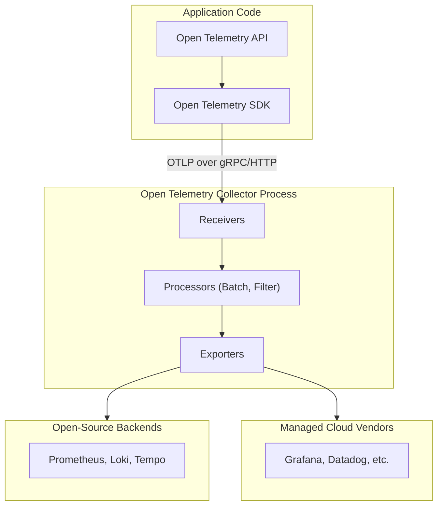

+++
title = 'Observability Notes'
summary = '''Master the fundamentals of observability. Explore the three telemetry signals, W3C trace context, OpenTelemetry pipeline design, and cost control strategies.'''
date = 2026-08-08T08:00:00-00:00
draft = false
tags = ['SecurityArchitecture', 'Technology', 'Observability', 'ROI']
mermaid = true
+++



>*These notes were prepared for a specific workshop talk and tailored to its distinct organizational context. Any deviations from standard frameworks or unbalanced levels of detail reflect the specific constraints, priorities, and technical focus of that session.*

## Core Principles: Monitoring vs. Observability

- **Monitoring**

  - Focuses on known unknowns: collecting and displaying pre-determined data points for anticipated failure modes.

  - Relies on static dashboards and threshold-based alerts set up in advance.

  - Leaves blind spots when unexpected, unmodeled failures occur (such as healthy green charts while user operations quietly fail).

- **Observability**

  - Addresses unknown unknowns: measuring internal system states purely from external outputs.

  - Allows developers to ask arbitrary new questions about running systems without shipping new code or deploying updated instrumentation.

  - Core metric of success is the ability to query raw request and booking events immediately upon encountering a novel bug.

## The Three Primary Telemetry Signals

### Logs

- **Definition:** Discrete, timestamped text entries capturing specific events.

- **Plain Text vs. Structured:** Plain text logs fail to scale in distributed systems due to heavy reliance on expensive regular expression queries.

- **Structured Logging:** Standardizes outputs using key-value pairs (typically JSON). Enables direct querying against attributes like status, booking ID, or duration.

### Metrics

- **Definition:** Aggregated numerical data points computed over specific time intervals.

- **Key Metric Types:**

  - *Counters:* Monotonically increasing values (for example, total requests served). Analyzed by calculating rate over time windows. Automatically handle system restarts returning to zero.

  - *Gauges:* Point-in-time snapshot values that fluctuate up and down (for example, active queue depth, memory consumption).

  - *Histograms:* Numerical values placed into defined buckets. Crucial for calculating overall fleet percentiles (such as P95 latency) accurately.

  - *Summaries Note:* Unlike histograms, client-calculated summaries cannot be aggregated safely across multiple node instances because percentiles cannot be averaged.

- **Standard Frameworks:**

  - *Four Golden Signals (Google):* Latency, Traffic, Errors, and Saturation.

  - *RED Method (Tom Wilkie):* Request Rate, Errors, and Duration (focuses on request-driven architectures).

  - *USE Method (Brendan Gregg):* Utilization, Saturation, and Errors (focuses on underlying physical or virtual resources).

- **Latency Measurement Rule:** Track latency using percentiles and distributions, never plain mathematical averages, as averages mask tail latency spikes affecting small subsets of users.

### Traces

- **Definition:** End-to-end request scopes following a single operation across internal code units and network boundaries.

- **Span Anatomy:**

  - *Span:* Single logical unit of work containing a name, start and end timestamps, custom attributes, status code, and unique span ID.

  - *Trace:* Directed acyclic graph (tree) of spans linked together by a shared root Trace ID and parent-child Span ID references.

- **Error Handling in Traces:** Exception handlers must explicitly mark the current span's status as errored, otherwise failing operations render as slow successful operations.

## Distributed Context Propagation & W3C Trace Context

Crossing process or network boundaries requires carrying trace context through requests using standards like W3C Trace Context, which replaces legacy proprietary headers (such as Zipkin's B3 or AWS's X-Amzn-Trace-Id) with a single vendor-neutral specification.

### Structure of W3C Trace Context Headers

The W3C specification defines two main metadata headers:

- **traceparent Header (Required):** Carries mandatory metadata needed to stitch parent and child spans together in a hyphen-delimited format (`version-trace_id-parent_id-trace_flags`).

  - *Version (2 hex characters):* Current specification version (`00`).

  - *Trace ID (32 hex characters / 16 bytes):* Globally unique identifier for the entire request path across all services.

  - *Parent ID (16 hex characters / 8 bytes):* Span ID of the caller's active span.

  - *Trace Flags (2 hex characters / 8-bit field):* Controls telemetry behaviors. The least significant bit (`01`) indicates whether the trace was sampled (`01` = sampled, `00` = not sampled).

- **tracestate Header (Optional):** Carries vendor-specific state information using a comma-separated list of key-value pairs (for example, `tracestate: vendor1=123,vendor2=456`). Downstream services pass through opaque vendor keys untouched while appending or modifying their own key-value pairs.

### Context Propagation Mechanics

Propagation involves Injection (serializing active span context into outbound headers) and Extraction (deserializing headers into a new child context).

- **HTTP / Synchronous Calls:**

    1. *Active Span:* Service A creates a span with a Trace ID and Span ID.

    2. *Injection:* Service A's client interceptor serializes the trace context into the outgoing request's `traceparent` header.

    3. *Extraction:* Service B's server framework inspects incoming headers, parses `traceparent` into a ParentContext, and sets the Trace ID and Parent Span ID.

    4. *Child Span Creation:* Service B starts an internal span with a newly generated Span ID linked to the extracted Parent Span ID. Failing to propagate headers breaks trace paths, resulting in orphaned downstream spans.

- **gRPC Calls:**

  - *Client Interceptor:* Reads active context and injects `traceparent` as a lowercase ASCII metadata key in HTTP/2 binary frame headers (`metadata.MD`).

  - *Server Interceptor:* Extracts `traceparent` from incoming gRPC metadata before passing control to the request handler.

  - *Context Binding:* Binds extracted parent span context to the runtime environment so internal database or downstream calls inherit the trace ID.

- **Asynchronous Message Queues:**

  - Background workers handle messages (via Kafka, RabbitMQ, SQS) long after producer spans end, so standard parent-child links do not apply cleanly.

  - Context headers are injected into broker-native metadata headers (such as Kafka record headers).

  - OpenTelemetry links producer and consumer spans via Span Links rather than direct hierarchy.

- **Legacy System Bridges:**

  - When calling legacy services expecting B3 headers (`X-B3-TraceId`), propagators can be configured for dual injection (sending both W3C and legacy headers simultaneously) during migration phases.

## Signal Correlation & Cost Control

### Correlation Mechanics

- Observability relies on linking all three signals rather than treating them as isolated silos.

- Inject active Trace IDs directly into structured log context.

- Attach Exemplars (small trace pointers) to specific metric buckets or spikes to link high-level charts directly to individual trace views without incurring high metric cardinality overhead.

### Managing Cardinality

- **High Cardinality:** Fields with massive sets of unique possible values (for example, User IDs, GUIDs).

- **Rule:** Keep high-cardinality fields attached strictly to logs and traces. Never add high-cardinality values as tags or labels on metrics, as each unique combination creates an independent, costly time series.

### Sampling Strategies

- **Head Sampling:** Decision to keep or drop a trace occurs at the entry point. Very low compute resource footprint, but risks discarding rare error traces.

- **Tail Sampling:** Holds all spans for a trace in a buffer until the full operation finishes. Retains traces selectively based on final status (such as an error occurring or execution exceeding a latency threshold). Requires trace-ID-based routing to ensure all spans land on the same collector node.

### Retention Windows

- **Metrics:** Long-term retention (for example, 1 year) via aggressive rollups and downsampling.

- **Traces:** Short-term retention (for example, 1–2 weeks) alongside head or tail sampling.

- **Logs:** Filter routine successes at the collector; retain errors for medium to long-term storage.

## OpenTelemetry Architecture

OpenTelemetry (OTel) is an open vendor-agnostic specification and toolchain under the CNCF for generating and exporting telemetry. Note that OpenTelemetry is not a storage backend or visualization UI.

- **API vs. SDK:** Code instruments against the abstract API. The SDK provides actual collection and processing logic.

- **Standard Wire Format:** OpenTelemetry Protocol (OTLP) running via gRPC or HTTP.

- **Collector:** Central processing pipeline containing Receivers, Processors (batching, masking, tail sampling), and Exporters.

- **Semantic Conventions:** Standardized naming keys across languages (for example, `http.request.method`). Note that `service.name` is mandatory.

- **Auto vs. Manual Instrumentation:**

  - *Auto-instrumentation:* Wraps common frameworks and libraries (HTTP, DB drivers) without modifying application code.

  - *Manual instrumentation:* Custom spans added manually to track domain-specific business logic.

## Advanced Telemetry Extensions

- **eBPF (Extended Berkeley Packet Filter)**

  - Runs sandboxed code inside the Linux kernel to collect network and system-call data automatically with zero code modifications or runtime overhead.

  - Limitation: Cannot extract application-level business context (such as checkout order amounts). Best paired with manual application spans.

- **Continuous Profiling**

  - Low-overhead sampling of the running process stack to attribute CPU and memory usage directly to specific lines of code via Flamegraphs.

- **Real User Monitoring (RUM) & Core Web Vitals**

  - Tracks browser and client device experience.

  - Key metrics: LCP (Largest Contentful Paint), INP (Interaction to Next Paint), CLS (Cumulative Layout Shift).

  - Browsers initiate the root trace and propagate trace context headers directly into backend requests.

## Reliability Engineering & Incident Operations

### Service Level Terminology

- **SLI (Service Level Indicator):** The quantifiable metric being measured (for example, successful booking ratio).

- **SLO (Service Level Objective):** Internal target threshold set for an SLI over a rolling time window (for example, 99.9% success).

- **SLA (Service Level Agreement):** External contract backed by financial or contractual penalties for missing targets.

### Error Budgets & Burn-Rate Alerting

- **Error Budget:** Allowed failure rate computed as `100% - SLO`.

- **Burn Rate Alerting:** Triggers alerts based on the rate at which the error budget is decaying rather than static resource limits. For example, a $14.4\times$ burn rate depletes 2% of a 30-day budget in 1 hour, warranting an immediate wake-up page.

- **Multi-Window Logic:** Uses multi-window, multi-threshold logic (combining long and short time windows) to avoid false positives and auto-resolve rapidly when errors subside.

- **Symptom-Based Alerting:** Route wake-up notifications based on customer-impacting symptoms (such as failing requests) rather than root causes (such as high CPU utilization).

### Incident Lifecycle & Incident Reviews

- **Alerting & Triage:** Alert fires based on error budget burn rate.

- **Investigation Flow:** Verify metric burn -> check deployment markers on metrics -> click exemplar to view exact trace -> read error logs tied to Trace ID -> isolate failing service.

- **Resolution:** Execute targeted mitigation (for example, rollback).

- **Blameless Post-Mortem:** Construct clear incident timelines and underlying systemic causes without placing personal blame, resulting in actionable prevention tasks.

## Reference Open-Source Stack Architecture

A standard production-grade stack using native open-source components:

- **Collection Pipeline:** OpenTelemetry Collector (or Grafana Alloy).

- **Trace Storage:** Grafana Tempo.

- **Log Storage:** Grafana Loki.

- **Metrics Storage:** Prometheus (using a pull/scrape model against collector endpoints).

- **Handling Short-Lived Batch Jobs (Pushgateway):** Prometheus uses a pull/scrape model against long-running endpoints. For ephemeral, short-lived workloads (such as cron jobs or batch pipelines) that finish before a scrape cycle occurs, applications push metrics to a **Prometheus Pushgateway**, which buffers the telemetry until Prometheus scrapes it.

- **Unified Visualization Layer:** Grafana (querying across Loki, Tempo, and Prometheus simultaneously via unified Trace IDs).
