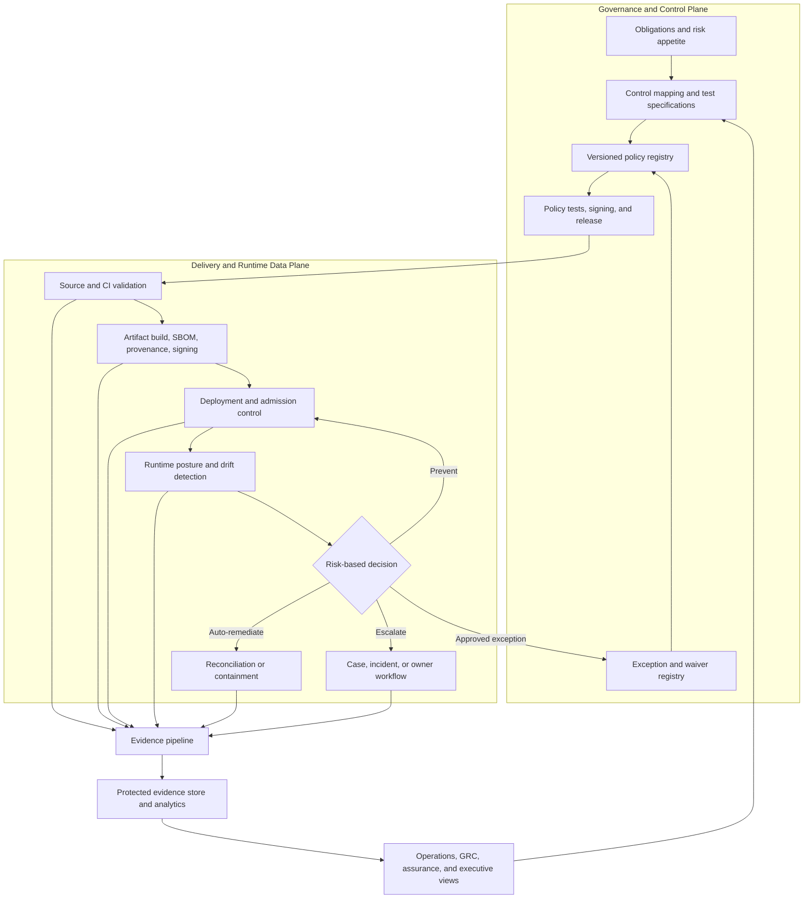
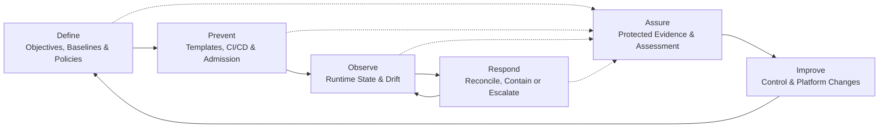
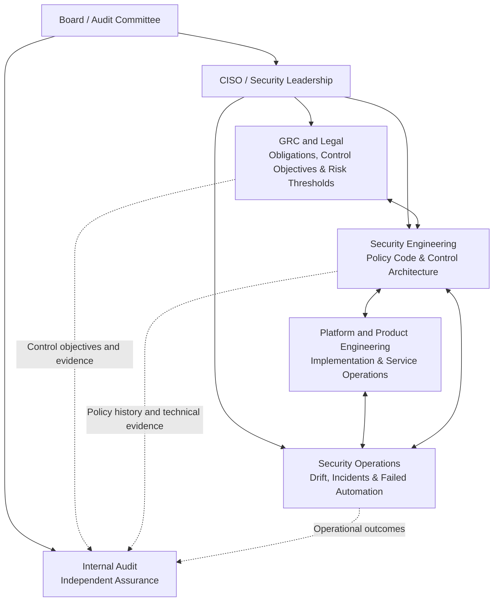

+++
title = 'DRAFT Technical State Compliance - Reference Architecture, Operating Model, and Assurance Guide'
summary = '''Explore a vendor-neutral architecture for continuous technical control evaluation, enforcement, remediation, evidence, and independent assurance'''
date = 2026-08-16T08:00:00-00:00
draft = false
tags = ['SecurityArchitecture', 'Technology', 'CyberSecurity']
mermaid = true
+++

>Technical state compliance is an operating model in which systems are continuously evaluated against approved technical baselines, material drift is detected quickly, selected violations are prevented or remediated safely, and control evidence is produced as part of normal operations. It complements rather than replaces risk assessment, legal interpretation, control testing, and independent audit.
>This article is technical guidance, not legal advice or a certification claim. Framework mappings are illustrative and should be validated by control owners, legal counsel where relevant, and qualified assessors. Product names are examples, not endorsements.

## Purpose, Scope, and Intended Audience

This document provides a vendor-neutral reference architecture for translating security and compliance obligations into continuously evaluated technical controls. It covers control design, preventive and runtime enforcement, evidence generation, organizational responsibilities, metrics, implementation sequencing, and technology-selection considerations.

The intended audience includes:

- security and enterprise architects
- technical GRC and continuous-assurance teams
- cloud, platform, DevOps, and security-engineering leaders
- service and product owners
- security operations and incident-response teams
- internal auditors and control assessors
- CISOs and technology leaders responsible for security transformation

The document assumes working knowledge of cloud infrastructure, CI/CD pipelines, infrastructure as code, security controls, operational risk, and audit terminology. It is an architectural guide rather than a complete control baseline, product implementation manual, legal interpretation, or certification framework.

---

Cloud platforms, containers, infrastructure as code, and high-frequency delivery have exposed a basic weakness in traditional compliance an annual assessment can show that a control worked on the day it was tested, but not that it remained effective afterward. The answer is not simply more scanning, but it is a closed-loop control system that connects obligations to executable tests, tests to enforcement points, enforcement outcomes to evidence, and evidence to accountable owners.

The target state is straightforward to state but demanding to implement:

- **Compliant by default:** approved templates and paved roads make the safe path the easiest path.

- **Continuously verified:** live state is compared with versioned baselines at a frequency appropriate to risk.

- **Safely self-healing:** only well-understood, reversible violations are remediated automatically.

- **Evidence-producing:** every material decision records what was tested, against which policy version, on which asset, with what result.

## What technical state compliance means

Technical state compliance is the practice of maintaining infrastructure, software, identities, and workloads in a **known and verified operational state** that aligns with defined technical requirements. It shifts the unit of compliance from a document or audit sample to an observable system state.

The term is best treated as an architectural and operating-model concept, not as a certification category. A passing policy check does not by itself prove legal or regulatory compliance. Many obligations depend on governance, process, human behavior, contractual scope, and risk decisions that cannot be reduced to configuration tests.

### Technical state compliance versus point-in-time assessment

| Dimension        | Point-in-time model                      | Continuous technical-state model                                                  |
| ---------------- | ---------------------------------------- | --------------------------------------------------------------------------------- |
| Primary evidence | Samples, screenshots, interviews         | Versioned decisions, state snapshots, telemetry, sampled validation               |
| Control timing   | Periodic                                 | Build time, deployment time, runtime, and scheduled reassessment                  |
| Change handling  | Reviewed after or around a change window | Evaluated before change and reconciled after deployment                           |
| Ownership        | Often centered in GRC or audit           | Shared by GRC, security engineering, platform teams, asset owners, SOC, and audit |
| Response         | Ticket-driven remediation                | Prevention, automated reconciliation, or risk-based escalation                    |
| Main limitation  | Long blind intervals                     | Automation blind spots, policy defects, and evidence integrity must be managed    |

Four capabilities form the core:

- **Declarative baselines.** Desired configurations are represented as versioned infrastructure, configuration, identity, and policy definitions.

- **Continuous evaluation.** Systems are evaluated at relevant control points: source, build, deployment, runtime, and periodic assurance.

- **Controlled response.** Violations are blocked, reverted, isolated, ticketed, or accepted through an expiring exception.

- **Traceable control mapping.** Each machine test has a documented relationship to a control objective, owner, evidence requirement, and risk rationale.

### Application and Data Controls

This architecture applies most directly to machine-observable technical state. It can support application authorization, API security, data classification and handling, retention, deletion, residency, and model or dataset governance where these requirements can be reliably observed and tested.

Application behavior, data-use purpose, privacy compliance, model suitability, and business-process effectiveness generally require additional domain-specific controls and human assessment. Infrastructure or platform compliance must not be interpreted as evidence that the applications and data using them are compliant.

### Automation Suitability

Not every compliance control can or should be automated. Automation suitability depends on whether the expected state is machine-observable, the decision can be expressed deterministically, and enforcement or remediation can occur without unacceptable operational risk.

|Classification|Description|Typical examples|
|---|---|---|
|**Highly automatable**|The expected state is machine-readable, and violations can be detected or prevented using reliable technical rules.|Encryption settings, prohibited public access, network exposure, required configuration values|
|**Partially automatable**|Evidence collection or initial evaluation can be automated, but interpretation, approval, or remediation requires human judgment.|Access reviews, vulnerability exceptions, segregation-of-duties conflicts, supplier-security findings|
|**Primarily manually assessed**|Effectiveness depends mainly on document review, interviews, exercises, sampling, or professional judgment.|Incident-response exercises, policy effectiveness, security training, governance reviews|
|**Non-technical**|The control operates primarily through legal, personnel, physical, or organizational measures.|Contractual clauses, employment screening, physical-access procedures, executive oversight|

Detection, enforcement, and remediation should be assessed separately. A control may be suitable for automated monitoring but not for automated remediation. For example, a system can automatically detect a configuration deviation while requiring an authorized operator to approve the corrective action. Automation supports control operation and evidence collection, but it does not replace accountable ownership or independent assessment.

#### Manual and Hybrid Controls

Partially automated and manually assessed controls should use the same traceability model as fully automated controls. Human approvals, reviews, and attestations should record the responsible identity, timestamp, scope, method, decision, rationale, supporting artifacts, and validity period.

Evidence should be linked to the applicable control, asset population, service, and exception. Expired attestations, incomplete reviews, and evidence outside its validity period must not be treated as proof of current compliance. Manual and automated evidence may be combined, but their sources, limitations, and assessment methods should remain distinguishable.

## Standards and regulatory context

The following sources commonly shape a technical compliance program. They are not interchangeable, and applicability must be determined by legal, risk, and assurance specialists.

| Source                       | Relevance to technical state compliance                                                                                                                                            |
| ---------------------------- | ---------------------------------------------------------------------------------------------------------------------------------------------------------------------------------- |
| NIST Cybersecurity Framework | Enterprise risk outcomes across Govern, Identify, Protect, Detect, Respond, and Recover. It is an outcomes framework, not a prescriptive control catalog.                          |
| NIST SP 800-53               | Detailed security and privacy controls, including configuration management, assessment, monitoring, audit, incident response, and system integrity.                                |
| NIST SP 800-53A              | Assessment procedures for examining, interviewing, and testing controls. Useful when defining evidence and test methods.                                                           |
| NIST SP 800-137              | Information-security continuous monitoring strategy, including metrics, assessment frequencies, analysis, and response.                                                            |
| ISO/IEC 27001                | Requirements for an information security management system. Technical automation supports the ISMS but does not replace it.                                                        |
| ISO/IEC 27002                | Implementation guidance for information-security controls, including configuration, logging, monitoring, access control, and cryptography.                                         |
| PCI DSS                      | Prescriptive requirements for environments storing, processing, or transmitting payment-account data and connected systems. Scope and compensating-control rules remain essential. |
| NIS2                         | Risk-management and incident-reporting obligations for covered entities. Member-state implementation and sector-specific rules determine enforceable details.                      |
| Cyber Resilience Act         | Cybersecurity requirements for products with digital elements, including vulnerability handling and conformity obligations across the product lifecycle.                           |

Two distinctions matter:

- **NIST CSF 2.0 and NIST SP 800-53 are complementary, not a single standard.** CSF expresses outcomes, SP 800-53 provides a control catalog.

- **NIS2 and the Cyber Resilience Act have different subjects.** NIS2 primarily governs covered entities and essential or important services, the CRA governs products with digital elements and their economic operators. Architecture should not collapse them into one technical standard.

## Design principles

A defensible implementation follows these principles:

- **One source of intended state, multiple sources of observed state.** Git may hold approved policy and infrastructure definitions, while cloud APIs, orchestrators, identity providers, EDR, network controllers, and asset inventories expose actual state.

- **Prevent before repairing.** Template validation and deployment gates are safer and cheaper than changing a running system.

- **Risk determines enforcement.** A critical public-storage exposure may justify immediate containment, a cosmetic tagging defect may justify a ticket.

- **No ungoverned automation.** Remediation must be idempotent, bounded, observable, reversible, and protected by a kill switch.

- **Evidence has provenance.** Store policy version, evaluator version, asset identity, timestamps, decision, relevant state, exception reference, and remediation outcome.

- **Exceptions are first-class objects.** Every exception needs an owner, rationale, scope, compensating controls, approval, expiration, and review history.

- **Define enforcement failure behavior.** Every policy enforcement point must specify what happens when it cannot obtain a valid policy decision. Depending on risk and availability requirements, it may deny the action (fail closed), permit it with monitoring and subsequent reevaluation (fail open), or apply a restricted fallback policy (degraded mode). The selected behavior, timeout, alerting, emergency bypass, and recovery process must be documented and tested.

- **Control efficacy is tested independently.** The team that operates an automated control should not be the only party that declares it effective.

## Reference architecture

The architecture is a closed loop spanning a **governance/control plane** and an **enforcement/evidence data plane**.

The lifecycle begins with approved control objectives and technical baselines, followed by preventive controls, runtime observation, and risk-based response. Evidence is produced at every stage and used for assurance and control improvement. Remediation returns the system to observation so that the resulting state can be independently verified.

### Foundation - asset, identity, and time

Continuous compliance cannot work without reliable foundations:

- a current inventory with stable asset and service identifiers

- ownership, criticality, data classification, environment, and regulatory scope metadata

- workload and machine identity, not only IP addresses

- authoritative time synchronization

- a service catalog connecting code repositories, deployment artifacts, runtime resources, and business services

Coverage metrics are unreliable when the complete population of in-scope assets is unknown. If assets are missing from the inventory, reported coverage may appear higher than it actually is.

#### Asset Lifecycle and Decommissioning

Technical state compliance must cover the complete asset lifecycle, not only systems currently in production. Newly discovered or created assets should be assigned a stable identity, owner, classification, service relationship, and applicable control baseline before they are reported as covered. Assets without sufficient metadata should be classified as unknown or incomplete rather than assumed to be compliant.

Changes in ownership, classification, regulatory scope, environment, or platform should trigger reevaluation of policy applicability. When a service migrates between platforms, inherited and service-owned controls should be reassessed, evidence continuity maintained, and any temporary reduction in coverage explicitly tracked.

Decommissioning should follow a controlled process that includes removing the asset from service, protecting or disposing of its data, revoking workload identities, credentials, keys, certificates, access grants, and active exceptions, and updating connected inventories and service records. A final state and control record should be captured where appropriate.

Evidence associated with a decommissioned asset should remain linked to its stable historical identity and retained according to applicable retention, privacy, legal-hold, and residency requirements. Removing an asset from operation or inventory must not silently remove evidence required to demonstrate its prior control state or authorized decommissioning.

#### External Services and Third-Party Dependencies

Direct inspection and enforcement may not be possible for SaaS, external APIs, managed AI services, supplier-operated systems, and outsourced platforms. Assurance may therefore combine provider configuration APIs, service telemetry, integration testing, contractual requirements, independent assurance reports, data-flow restrictions, compensating controls, and supplier-risk reviews.

The control mapping should identify which technical states are directly verified, which rely on provider evidence, and which remain unverified. Limitations in access or evidence must not be reported as continuous technical coverage. Critical dependencies should also have documented contingency, portability, and exit plans.
  
### Layer 1 - policy and rule definition
  
This layer translates an obligation into a testable specification. Policies may use Rego/OPA, Kyverno rules, cloud-native policy languages, Cedar for application authorization, or configuration-management assertions. YAML is a serialization format, not inherently a policy language, its semantics come from the engine that consumes it.

A policy release should include:

- a unique control and rule identifier

- rationale and source requirement

- applicable asset types and scope conditions

- machine-readable rule

- positive, negative, and boundary tests

- severity and enforcement mode

- evidence fields and retention class

- owner, approver, version, and change history

- remediation and exception behavior

Policy repositories require the same controls as production code, peer review, branch protection, automated tests, artifact signing where appropriate, separation of duties, and controlled promotion between environments.

Where multiple policies or enforcement technologies apply, the organization should define decision precedence, policy authority, conflict-resolution rules, and ownership. Conflicting decisions must produce an explicit error or escalation outcome rather than being silently interpreted as compliant.  

### Layer 2 - shift-left validation

Pre-deployment checks evaluate:

- infrastructure-as-code plans and modules

- Kubernetes and application manifests

- software dependencies, licenses, and known vulnerabilities

- container images and operating-system packages

- secrets exposure

- SBOM presence and artifact provenance

- identity and network policy declarations

A pipeline should return actionable feedback failed rule, affected resource, expected state, actual state, remediation guidance, severity, and exception path. Start new rules in observation mode, tune them using representative workloads, and enable hard blocking only after ownership and false-positive handling are established.

### Layer 3 - deployment and runtime enforcement

Pipeline controls are necessary but insufficient. Manual changes, emergency operations, compromised credentials, external controllers, and provider-side changes can alter production state.

Runtime controls include:

- Kubernetes validating admission policies or admission controllers

- cloud-policy services and configuration recorders

- identity entitlement and privileged-access monitoring

- configuration-management and GitOps reconciliation

- endpoint and workload agents where agentless APIs are insufficient

- network and service-mesh policy

- firmware, secure-boot, TPM, or workload-attestation signals where justified

Runtime enforcement can apply zero-trust principles by making resource-access decisions through defined policy decision and enforcement points. Decisions may consider workload or user identity, device and resource state, requested action, data sensitivity, environmental context, and current risk signals. Access should be limited to the specific resource and action required rather than granted solely because a subject is connected to an internal network.

Technical state compliance and zero trust are complementary. Technical state compliance verifies whether systems and controls remain within approved boundaries. Zero trust applies explicit, context-aware decisions to access between subjects and resources. Compliance-state signals can inform access decisions, for example, restricting a workload whose identity, provenance, or runtime configuration no longer meets policy.

Attestation should answer a specific trust question, for example, whether an artifact came from an approved build or whether a workload possesses an authorized identity. Technologies such as TPM-based attestation, SPIFFE/SPIRE, Sigstore, in-toto, and SLSA address different parts of this problem, none is a universal proof of compliance.

#### How they fit together

| Technology                | Primary purpose                                                                  | What it helps establish                                                                                                                        |
| ------------------------- | -------------------------------------------------------------------------------- | ---------------------------------------------------------------------------------------------------------------------------------------------- |
| **TPM-based attestation** | Device and platform integrity                                                    | A machine started in an expected measured state                                                                                                |
| **SPIFFE/SPIRE**          | Standardized workload identity; implementation and issuance of SPIFFE identities | A workload has a verifiable identity and has been authorized, based on configured attestation and registration rules, to receive that identity |
| **Sigstore**              | Artifact signing and verification                                                | An artifact is intact and associated with an authenticated signer                                                                              |
| **in-toto**               | Supply-chain process attestations                                                | Required build and delivery steps occurred                                                                                                     |
| **SLSA**                  | Supply-chain security framework                                                  | The build process and provenance meet defined assurance requirements                                                                           |

#### Distinct Software Supply-Chain Claims

Software signatures, provenance, SBOMs, vulnerability assessments, and admission controls provide different forms of assurance:

| Mechanism                | Question it answers                                                                                        | What it does not establish by itself                                                                                     |
| ------------------------ | ---------------------------------------------------------------------------------------------------------- | ------------------------------------------------------------------------------------------------------------------------ |
| Artifact signature       | Is the artifact unchanged, and is its signature associated with an accepted signing identity?              | That the software is secure, vulnerability-free, correctly built, or approved for deployment.                            |
| Build provenance         | Where, how, and from which inputs was the artifact built?                                                  | That the source, dependencies, build process, or resulting software are free from vulnerabilities or malicious behavior. |
| SBOM                     | Which declared software components and dependencies are present in an artifact?                            | That the component inventory is complete, that listed components are safe, or that no undeclared code is present.        |
| Vulnerability assessment | Are the identified components or artifact associated with known vulnerabilities at the time of evaluation? | That no unknown vulnerability exists or that an identified vulnerability is exploitable in the deployed environment.     |
| Admission control        | Does the artifact or workload satisfy the organization’s current deployment policy?                        | That it will remain compliant or secure after deployment. Runtime monitoring is still required.                          |

These mechanisms are complementary. For example, an admission policy may require a valid artifact signature, acceptable build provenance, an SBOM, and vulnerability results within a defined age and severity threshold. The resulting admission decision demonstrates that the deployment met the policy at that time, but it does not prove that the software is universally trustworthy or will remain compliant throughout its runtime lifecycle.

Trust also depends on the supporting governance like approved signing identities, protected trust roots, provenance-verification rules, SBOM quality, vulnerability-data freshness, documented exceptions, and reliable enforcement at deployment.

### Layer 4 - remediation and containment

Response should be selected by risk and operational safety:

| Response mode      | Appropriate use                                          | Required safeguard                                                |
| ------------------ | -------------------------------------------------------- | ----------------------------------------------------------------- |
| Prevent            | High-confidence, high-impact violation before deployment | Tested policy, reliable exception path, defined outage behavior   |
| Reconcile          | Low-risk drift with a clear desired state                | Idempotency, bounded scope, rollback, loop detection              |
| Contain            | Active exposure or compromised identity                  | Pre-approved playbook, incident record, recovery procedure        |
| Ticket/escalate    | Ambiguous state or business-context decision             | Owner and SLA, evidence attached, aging escalation                |
| Accept temporarily | Documented risk exception                                | Named approver, compensating control, expiration, periodic review |

Automatic patching is not always safe. In safety-critical, operational-technology, medical, and high-availability environments, detection may be continuous while remediation remains manually authorized and maintenance-window controlled.

### Layer 5 - continuous evidence and telemetry

 OpenTelemetry can standardize the generation and transport of traces, metrics, and logs. It does **not** make records immutable, complete, or legally sufficient. Evidence integrity requires additional controls such as:

- authenticated sources and collectors

- encryption in transit and at rest

- access control and separation of duties

- synchronized timestamps and stable asset identity
  
- documented evidence lineage connecting the original observation to collection, normalization, policy evaluation, storage, and reporting, including the systems and transformations applied at each stage

- append-only or Write Once, Read Many (WORM)  retention where required

- hashing, signing, trusted timestamping, or ledgering where the threat model justifies it

- retention, legal hold, privacy minimization, and residency controls

- monitoring for dropped, delayed, duplicated, or malformed events

Evidence lineage should make each material decision traceable to its original data source. The organization should record how observed state was collected, transformed, evaluated, and stored, including relevant collector, schema, policy, and evaluator versions. This allows assessors to reproduce decisions, identify transformations that may have affected the evidence, and determine whether the reported result accurately represents the original observation.

The evidence architecture should support automated decisions, human approvals, attestations, and assessment records through a common control and asset-identification model.

A minimal compliance-decision event should record:

| Field                   | Example                                | Purpose                                                                                                           |
| ----------------------- | -------------------------------------- | ----------------------------------------------------------------------------------------------------------------- |
| **Event type**          | `compliance.policy.decision`           | Identifies the record as a policy-evaluation event.                                                               |
| **Event time**          | `2026-01-15T10:03:21Z`                 | Records when the policy decision occurred, using a standardized timestamp format.                                 |
| **Asset ID**            | `cloud:prod:storage:customer-exports`  | Uniquely identifies the infrastructure resource, workload, endpoint, or application that was evaluated.           |
| **Service ID**          | `svc-customer-reporting`               | Links the evaluated asset to its business or technical service.                                                   |
| **Environment**         | `production`                           | Identifies the deployment environment, such as development, test, staging, or production.                         |
| **Policy ID**           | `STORAGE-001`                          | Identifies the policy rule used to evaluate the asset.                                                            |
| **Policy version**      | `3.4.2`                                | Records the exact version of the policy used to make the decision.                                                |
| **Evaluator**           | `policy-engine/1.18.0`                 | Identifies the policy engine and software version that performed the evaluation.                                  |
| **Result**              | `fail`                                 | Records the policy decision, such as `pass`, `fail`, `error`, or `not-applicable`.                                |
| **Severity**            | `critical`                             | Indicates the risk or operational priority assigned to the violation.                                             |
| **Observed-state hash** | `sha256:…`                             | Provides a cryptographic reference to the system state evaluated by the policy engine.                            |
| **Exception ID**        | `null`                                 | Links the decision to an approved exception, if one exists. A null value indicates that no exception was applied. |
| **Action**              | `public-access-block-enabled`          | Records the preventive, corrective, or containment action triggered by the decision.                              |
| **Action result**       | `success`                              | Indicates whether the action completed successfully, failed, or remains pending.                                  |
| **Correlation ID**      | `f467e65d-79f3-4881-97a2-735ac2be3a55` | Links the policy decision to related deployment, remediation, incident, audit, or workflow events.                |

>***Note:** Automated evaluation coverage and independent assessment coverage are not the same. A policy engine may evaluate the complete known asset population, while an assessor independently reperforms only a risk-based sample. Full automated coverage does not eliminate the need to validate inventory completeness, data-source reliability, policy design, exception handling, and the accuracy of passing and failing decisions.*

Avoid placing secrets or unnecessary personal data in evidence records. Preserve the underlying state snapshot or a verifiable reference when a hash alone would not let an assessor reproduce the decision.

## From Obligations to Executable Controls

Control mapping is more than linking a technical rule to a paragraph in a framework. A defensible mapping establishes traceability from the original obligation to its implementation, operation, and assessment:

> **Authoritative source - obligation - control objective - scope and asset population - technical test - enforcement point - freshness requirement - evidence and integrity controls - assessment procedure and coverage - mapping strength - owner - exception path**

Each element answers a different assurance question:

- **Authoritative source:** Where does the requirement originate, and which version or provision applies?
- **Scope and asset population:** Which systems, services, environments, and resources are subject to the control?
- **Freshness requirement:** How recent must an evaluation be to represent the current state?
- **Evidence integrity:** How are the authenticity, completeness, traceability, and protection of evidence maintained?
- **Assessment coverage:** How much of the in-scope population is evaluated, and which full-population, risk-based, representative, or targeted methods are used to validate control effectiveness independently?
- **Mapping strength:** Does the technical test directly evaluate the control objective, or does it provide only supporting or contextual evidence?

The following example illustrates how an obligation can be translated into a verifiable technical control:

| Mapping element                | Example                                                                                                                                                                                                                                                            |
| ------------------------------ | ------------------------------------------------------------------------------------------------------------------------------------------------------------------------------------------------------------------------------------------------------------------ |
| **Authoritative source**       | Internal Data Protection Standard, section 4.2, version 3.1; mapped to applicable external access-control and configuration requirements.                                                                                                                          |
| **Obligation**                 | Protect sensitive object storage against unauthorized public access.                                                                                                                                                                                               |
| **Control objective**          | Production object stores containing restricted data are not publicly accessible.                                                                                                                                                                                   |
| **Scope and asset population** | All production object stores classified as containing `restricted` data across in-scope accounts, subscriptions, projects, and regions.                                                                                                                            |
| **Technical test**             | Public access-control lists and public-access policies are absent, and the platform-level public-access restriction is enabled.                                                                                                                                    |
| **Enforcement point**          | Infrastructure-as-code pipeline gate, deployment control, and runtime cloud-policy evaluation.                                                                                                                                                                     |
| **Freshness requirement**      | Evaluate before deployment, after configuration changes, and at least once during the defined continuous-monitoring interval. Results older than that interval are classified as stale rather than compliant.                                                      |
| **Evidence object**            | Resource and service identifiers, data classification, observed properties, policy and evaluator versions, timestamp, decision, exception reference, and remediation outcome.                                                                                      |
| **Evidence integrity**         | Authenticated collection, synchronized timestamps, encrypted transport, restricted access, protected retention, and monitoring for missing or altered records.                                                                                                     |
| **Assessment procedure**       | Reperform the technical test, inspect policy changes and approved exceptions, verify the reliability of evidence sources, and confirm that stale or failed evaluations are not reported as compliant.                                                              |
| **Assessment coverage**        | Automated policy evaluation covers the complete known in-scope population. Independent assessment uses risk-based sampling, including critical resources, recent changes, approved exceptions, failed evaluations, and a representative sample of passing results. |
| **Mapping strength**           | Direct for the internal prohibition on public storage; supporting for broader external access-control and configuration-management requirements.                                                                                                                   |
| **Owner**                      | The cloud platform owner is accountable for control operation; Security Engineering owns the shared policy implementation; service owners remediate affected resources.                                                                                            |
| **Exception path**             | Time-limited approval by an authorized risk owner, with documented rationale, compensating controls, scope, expiration, and review requirements.                                                                                                                   |

The mapping record should reference applicable evidence-protection requirements without duplicating the evidence architecture described in **Layer 5 — Continuous Evidence and Telemetry**. Similarly, the authoritative-source field should identify the relevant requirement, provision, version, and jurisdiction without reproducing or independently interpreting the full legal or regulatory text. Detailed interpretation remains the responsibility of Legal, GRC, and designated control owners.

An executable policy is only one implementation artifact within a broader control definition. A complete control must also define its objective, applicability, ownership, testing, enforcement behavior, evidence requirements, framework mappings, and exception process.

### Mapping Strength

Mapping strength describes how directly a technical test relates to a specific control objective. It is not a general rating of the quality of the policy or the control.

|Mapping strength|Meaning|
|---|---|
|**Direct**|The technical test evaluates an explicit, machine-observable condition required by the control objective.|
|**Supporting**|The test provides evidence for part of the control objective, but additional technical, procedural, or human assessment is required.|
|**Contextual**|The result informs the assessment or risk decision but does not directly test whether the control objective is satisfied.|

The same technical test can have different mapping strengths depending on the requirement. For example, verifying that public access is disabled may directly test an internal storage-security requirement while providing only supporting evidence for a broader external access-control obligation.

A passing result is meaningful only for the defined scope, asset population, policy version, data source, and freshness period. Stale, incomplete, failed, or unverifiable evaluations must not be reported as evidence of current compliance.

### Measuring Control Operation

Once a control has been translated into a technical specification, the organization must determine whether it is deployed, operating effectively, and producing the intended result. Operational metrics can support this evaluation, but a metric is not itself a control and does not independently demonstrate compliance.

Metrics such as drift-detection latency, policy coverage, and remediation time help evaluate control operation. Their value depends on reliable asset inventories, clearly defined denominators, current data, trustworthy evidence, and appropriate assessment procedures.

### Illustrative NIST SP 800-53 mapping

The following mapping is a starting hypothesis for control owners and assessors, not a statement that a metric satisfies a control. Control applicability depends on the selected baseline, tailoring, organization-defined parameters, system context, and assessment method.

Some metrics in this document are operational measures rather than metrics explicitly required or defined by NIST SP 800-53. They are included because they can help demonstrate whether related controls are implemented, monitored, and operating as intended. The controls cited in the mapping provide supporting requirements or capabilities used to define the expected state, identify the in-scope population, perform monitoring, manage deviations, or evaluate remediation.

These mappings are traceability aids, not evidence of control satisfaction. Control effectiveness must be assessed using appropriate procedures, including examination of artifacts, interviews, technical testing, population validation, and verification that the control operates at the required frequency.

>***Scope note:** This table intentionally includes only the controls most relevant to the selected technical-state metrics. It is not a complete mapping of NIST SP 800-53 or an applicable control baseline.*

| Metric or capability               | Most relevant SP 800-53 Rev. 5 controls                               | Relevance and limitations                                                                                                                                                                                                                                                          |
| ---------------------------------- | --------------------------------------------------------------------- | ---------------------------------------------------------------------------------------------------------------------------------------------------------------------------------------------------------------------------------------------------------------------------------- |
| **Drift detection latency**        | SI-4, CA-7, CM-6, CM-3; supported by CM-8 and, where applicable, SI-7 | System and continuous monitoring support timely detection. Configuration controls define approved settings and changes. CM-8 establishes the asset population but does not itself detect drift. SI-7 applies when software, firmware, or information integrity is being monitored. |
| **Drift remediation latency**      | CM-3, CM-6; SI-2 and IR-4 where applicable                            | Configuration controls support restoring approved state through controlled changes. SI-2 applies to software and firmware flaws; IR-4 applies when the drift is handled as a security incident.                                                                                    |
| **Baseline-policy coverage**       | CM-2, CM-6, CM-8, CA-7                                                | Baselines and configuration settings define expected state, inventory defines the in-scope population, and continuous monitoring supports ongoing evaluation. The controls do not prescribe a specific coverage percentage.                                                        |
| **Pipeline prevention**            | SA-11, SA-10, CM-4, CM-3; supported by SA-8                           | Developer testing, development configuration management, change-impact analysis, and change control support pre-deployment evaluation. SA-8 provides broad engineering principles rather than a specific pipeline requirement.                                                     |
| **Evidence generation and review** | AU-2, AU-3, AU-6, AU-12, AU-9, CA-7                                   | These controls address event selection, audit-record content, generation, review, analysis, protection, and continuous-monitoring reporting.                                                                                                                                       |
| **Exceptions and overdue actions** | RA-7, CA-5, PM-4, CM-3; CM-6 where applicable                         | Risk-response and POA&M[^1] controls support formal treatment and tracking of deviations. Configuration controls support approved changes or exceptions. The organization must separately define approval, compensating controls, expiration, renewal, and closure requirements.   |
| **High-risk unresolved findings**  | RA-3, RA-7, CA-5; SI-2 where applicable                               | Risk assessment identifies exposure, risk response determines treatment, and POA&M processes track remediation. SI-2 applies specifically when findings concern software or firmware flaws.                                                                                        |

These relationships do not imply one-to-one equivalence between a technical metric and a NIST control. A metric may provide direct evidence for one part of a control, supporting evidence for another, and only contextual information for a broader governance objective. A complete assessment may therefore require multiple evidence sources and a combination of automated testing, document examination, interviews, sampling, and professional judgment.

## Operating Model

Continuous compliance turns compliance into a shared engineering discipline while preserving clear accountability and independent assurance. Governance teams define control objectives and risk boundaries, security engineers translate those objectives into technical policies, platform teams operate the enforcement mechanisms, service owners remain accountable for their services, and security operations responds to material drift and incidents.

Internal Audit provides independent assurance and should not design or operate the controls it later assesses.

The diagram simplifies organizational reporting relationships. In practice, Legal and GRC may be separate functions. Legal interprets applicable legal and regulatory obligations, while GRC translates those obligations into control objectives, risk requirements, and governance processes. Internal Audit should retain an independent functional reporting line, typically to the board or audit committee.

### Roles and Responsibilities

- **GRC and Legal** identify applicable obligations, define control objectives, establish risk thresholds, and govern the policy-exception process.
- **Security Engineering** translates control objectives into technical policies, tests policy implementations, and designs the supporting control architecture.
- **Platform and DevOps teams** integrate controls into delivery and runtime platforms and operate shared enforcement services.
- **Service owners** remain accountable for the compliant operation of their services, remediation of findings, and acceptance of risk within their delegated authority.
- **Security Operations** detects and triages material drift, investigates failed automation, and manages declared security incidents according to the incident-response plan.
- **Internal Audit** independently evaluates control design and operating effectiveness without owning or operating the controls being assessed.

### RACI Matrix

The following matrix provides an illustrative allocation of responsibilities. It should be adapted to the organization’s structure, delegated authority, and incident-management model.

- **A — Accountable:** Owns the outcome and has final decision-making authority.
- **R — Responsible:** Performs or coordinates the work.
- **C — Consulted:** Provides specialist input before a decision or action.
- **I — Informed:** Receives relevant status and outcome information.

Each activity should have one clearly designated accountable role in the organization’s final operating model.

| Lifecycle activity                                      | GRC | Security engineering | Platform / DevOps | Service or risk owner |     SOC | Internal Audit |
| ------------------------------------------------------- | --: | -------------------: | ----------------: | --------------------: | ------: | -------------: |
| **Interpret obligations and define control objectives** | A/R |                    C |                 C |                     C |       I |              C |
| **Author and test shared policy code**                  |   C |                  A/R |                 C |                     C |       I |              I |
| **Approve policies for operational use**                |   A |                    R |                 C |                     C |       I |              I |
| **Integrate controls into delivery platforms**          |   I |                    C |               A/R |                     C |       I |              I |
| **Own service compliance and remediation**              |   I |                    C |                 R |                     A |       C |              I |
| **Operate runtime enforcement services**                |   I |                    C |               A/R |                     C |       C |              I |
| **Detect and triage material drift**                    |   I |                    C |                 C |                     A |       R |              I |
| **Restore a service to its approved state**             |   I |                    C |                 R |                     A |       C |              I |
| **Handle declared security incidents**                  |   I |                    C |                 C |                     C | A/R[^2] |              I |
| **Administer the exception process**                    | A/R |                    C |                 C |                     C |       I |              I |
| **Approve risk exceptions**                             |   C |                    C |                 C |                 A[^3] |       I |              I |
| **Validate evidence completeness**                      | A/R |                    C |                 C |                     C |       I |              I |
| **Independently assess control effectiveness**          |   C |                    I |                 I |                     I |       I |            A/R |

### Control and Policy Accountability

The matrix distinguishes between accountability for a **control objective** and accountability for its **technical implementation**.

GRC or the designated control owner is accountable for defining the intended control outcome and confirming that it reflects applicable obligations and risk decisions. Security Engineering is accountable for the quality and maintenance of shared policy code used to implement that objective. Platform teams are accountable for integrating and operating enforcement services, while service owners are accountable for addressing findings affecting their services.

This separation prevents technical policy code from becoming disconnected from its original governance objective.

### Exception Governance

GRC should administer the exception process but should not automatically accept business or operational risk. An authorized service, business, or enterprise risk owner should make the final risk-acceptance decision.

Every exception should define:

- the affected control, assets, and environments
- the business and technical rationale
- the risk created by the deviation
- required compensating controls
- the accountable risk owner
- the approval and review history
- an expiration or mandatory review date
- the conditions for renewal or closure

Exceptions that exceed delegated risk authority must be escalated to the appropriate executive or risk committee.

### Drift and Incident Management

Configuration drift does not always constitute a security incident. Routine drift may result from an authorized operational change, a defective deployment, an external controller, or a failed reconciliation process. Security Operations may detect and triage the event, but the service owner remains accountable for restoring the service to its approved state.

When drift indicates compromise, unauthorized access, material exposure, or another defined incident condition, responsibility transitions to the organization’s incident-response process. The designated incident commander or security-operations leader then coordinates containment, investigation, recovery, evidence preservation, and communication.

### Independent Assurance

Internal Audit may advise on evidence requirements, auditability, and assessment readiness, but it should not design, operate, approve, or routinely validate controls that it later assesses. Routine evidence-quality checks should remain with GRC, control owners, or a continuous-assurance function.

Internal Audit should independently evaluate whether:

- controls are appropriately designed
- the in-scope asset population is complete
- policies were approved and changed through authorized processes
- enforcement mechanisms operated at the required frequency
- exceptions were properly authorized and time limited
- evidence is complete, reliable, and protected
- remediation actions achieved their intended outcome
- reported metrics accurately represent the underlying control state

Maintaining this separation allows continuous compliance to operate as a shared engineering capability without weakening independent oversight.

## Metrics that reveal control health

Metrics should be segmented by asset criticality, environment, control family, and business service. An enterprise average can hide a critical uncontrolled population.

| Metric                   | Formula                                                                                                                                              | Interpretation                                                                                                     |
| ------------------------ | ---------------------------------------------------------------------------------------------------------------------------------------------------- | ------------------------------------------------------------------------------------------------------------------ |
| Drift MTTD               | Sum of (detection time − drift start time) / detected drift events                                                                                   | Speed of detection. Use percentiles as well as a mean.                                                             |
| Drift MTTR               | Sum of (verified restoration time − detection time) / remediated events                                                                              | Speed of verified recovery, not merely ticket closure.                                                             |
| Policy coverage          | In-scope assets evaluated successfully / total known in-scope assets                                                                                 | Requires a trustworthy inventory and records of failed evaluations.                                                |
| Prevention rate          | Violations stopped before production / all distinct violations detected                                                                              | Indicates shift-left effectiveness; deduplicate repeated findings.                                                 |
| Evaluation failure rate  | Evaluations ending in an error, timeout, invalid response, or processing failure / total attempted evaluations                                       | Measures the reliability of policy evaluation. A valid non-compliant result is not an evaluation failure.          |
| Freshness compliance     | In-scope asset-policy evaluations completed successfully within their required freshness interval / total expected in-scope asset-policy evaluations | Measures whether evaluation results are current. Missing, failed, and stale evaluations are not compliant results. |
| Policy pass rate         | Compliant evaluated assets / successfully evaluated in-scope assets                                                                                  | Report unevaluated and telemetry-dark assets separately.                                                           |
| False-positive rate      | Confirmed invalid findings / investigated findings                                                                                                   | Define “invalid” consistently; track false negatives through assurance testing.                                    |
| Active exception ratio   | In-scope assets or rules under active exception / applicable population                                                                              | Asset-weighted and risk-weighted views are more useful than raw counts.                                            |
| Overdue exception rate   | Expired unresolved exceptions / all expired exceptions                                                                                               | Target should normally be zero, with immediate escalation.                                                         |
| Auto-remediation success | Successful verified remediations / attempted remediations                                                                                            | Also track rollback, recurrence, and automation-caused incidents.                                                  |
| Evidence completeness    | Decisions containing all required evidence fields / expected decisions                                                                               | Detects silent telemetry failure.                                                                                  |
| High-risk SLA breach     | Open high/critical violations beyond SLA                                                                                                             | Report count, age, risk owner, and affected business services.                                                     |
| Audit effort             | Staff hours and external cost per control or assessment                                                                                              | Establish a measured baseline before claiming savings.                                                             |

> ***Note:** Coverage, evaluation success, freshness, and pass rate should be reported together. Coverage shows whether the required population is evaluated; evaluation failure rate shows whether attempted evaluations produce valid decisions; freshness shows whether those decisions remain current; and pass rate shows how many successfully evaluated assets meet their applicable policies. A stale, missing, or failed evaluation must never be interpreted as a passing result.*

Targets such as five-minute detection or 90% coverage can be useful internal SLOs, but they are not universal standards. Set targets from asset criticality, threat model, change frequency, regulatory obligations, and operational capability.

Executive reporting should answer four questions:

- What proportion of critical services is verified, unverified, compliant, excepted, or non-compliant?

- Which material exposures are beyond risk tolerance or SLA?

- What causes drift like manual change, defective template, third-party update, compromised identity, or missing coverage?

- Is the control system itself healthy, policy service availability, evidence completeness, exception aging, and automation failure rate?

## Maturity model

| Level          | Characteristics                                             | Exit evidence                                                                                |
| -------------- | ----------------------------------------------------------- | -------------------------------------------------------------------------------------------- |
| 1 — Reactive   | Manual evidence, fragmented inventory, findings after audit | Named owners, scoped inventory, baseline controls, measured audit effort                     |
|                |                                                             |                                                                                              |
| 2 — Observable | Periodic posture scans and ticket workflows                 | Reliable coverage data, severity model, exception registry, response SLAs                    |
| 3 — Preventive | Policy tests in CI/CD and deployment gates                  | Tested policy releases, developer feedback, controlled hard gates, provenance                |
| 4 — Adaptive   | Continuous runtime evaluation and bounded self-healing      | Verified remediation, low evidence-loss rate, independent control testing, risk-based tuning |

Maturity should not be equated with the percentage of automated controls. A well-governed manual approval may be more effective than unsafe automation in OT or safety-critical systems.

## Start With Shared Platform Building Blocks

In my experience, technical state compliance is safer and more scalable when implementation begins with shared building blocks delivered internally as managed platforms. Examples include identity services, developer tooling such as Azure DevOps, Kubernetes clusters, data platforms such as Databricks, AI gateways, and model-serving platforms.

Starting at the platform layer creates reusable controls, consistent enforcement, and common evidence for many consuming services. It also aligns responsibility with authority. Platform teams should own the controls embedded in platforms they build and operate. Service teams should not be expected to correct underlying platform controls they cannot administer.

Internal customers should nevertheless participate in platform selection, requirements definition, and acceptance testing. Their involvement helps ensure that controls support real workloads and that secure defaults are practical. They remain responsible for their applications, workloads, data, and configurations within the boundaries delegated to them.

For each platform, document which controls are platform-provided, jointly operated, or service-owned, including the assumptions and evidence supporting control inheritance. Platform teams own platform-level controls, while consuming teams remain accountable for their applications, data, delegated configurations, and correct use of the platform. Services that cannot use an approved platform should implement equivalent controls where feasible or follow the established exception and risk-acceptance process.

A practical sequence is:

1. Select a widely used platform building block with clear ownership.
2. Define its control boundary, baseline, evidence, and failure behavior.
3. Test it with representative internal customers.
4. Document which controls are platform-provided, shared, or service-owned.
5. Expand controls into consuming services and additional platforms.

This platform-first approach provides scale, but it also creates concentration risk. Shared controls therefore require staged rollout, canary testing, rollback, operational monitoring, and clear escalation paths.

## Implementation roadmap

A fixed time roadmap is plausible for a bounded scope, but sequence and exit criteria are more important than dates. You should set dates based on your organization agility and track record of executing change, not just hope or simplistic slide deck.

### Phase 1 — Foundation and control design

- Select one or more shared platform building blocks, two or three material control families, representative internal customers, and a bounded production scope

- Establish asset identity, ownership, criticality, and inventory reconciliation.

- Create the obligation-to-test mapping model and policy repository.

- Define policy lifecycle, separation of duties, exception workflow, and enforcement modes.

- Specify the evidence schema, retention classes, access model, and data residency.

- Measure current audit effort, drift volume, detection time, and remediation time.
  
- Document which controls are platform-provided, jointly operated, or service-owned.
  
**Exit criteria:** accountable owners exist; the denominator is credible; policies have tests; exceptions expire; evidence requirements are approved by assurance and privacy stakeholders.

### Phase 2 — Shift-left and paved roads

- Add IaC, manifest, image, dependency, and secret checks to standard pipelines.

- Provide approved modules and templates, not only blocking rules.

- Run rules in observe mode, analyze false positives, and publish remediation guidance.

- Enable hard gates for high-confidence, high-impact violations.

- Sign release artifacts and record policy and build provenance where appropriate.

**Exit criteria:** developers receive **actionable** results; bypasses are controlled and logged; high-severity gates meet reliability SLOs; pipeline latency is acceptable.

### Phase 3 — Runtime assurance and evidence

- Deploy admission controls, cloud configuration evaluation, and identity-posture monitoring.

- Compare runtime resources with both policy baselines and intended Git/IaC state.

- Route normalized decisions to a protected evidence store.

- Build views for service owners, SOC, GRC, and assurance.

- Test telemetry loss, collector failure, policy-service outage, and inventory mismatch.

**Exit criteria:** material manual drift is detected within the agreed SLO; telemetry gaps generate alerts; assessors can reproduce a sample of policy decisions.

### Phase 4 — Bounded automation and scale

- Automate only deterministic, reversible, low-blast-radius cases first.

- Add canary remediation, rate limits, approvals, kill switches, and rollback.

- Exercise simulated drift and automation-failure scenarios.

- Expand control and platform coverage based on risk, not just tool availability.

- Conduct an independent readiness assessment before external-audit reliance.

**Exit criteria:** remediation outcomes are verified; automation cannot loop indefinitely meaning repeated or conflicting remediation attempts are automatically stopped and escalated for human review.; incidents caused by automation are measured; residual risk and limitations are documented.

## Technology selection guide

Select tools by control requirement and operating model rather than by feature count.
  
| Capability                            | Technology category                                                                                | Key selection questions                                                                                                                                                                                                       |
| ------------------------------------- | -------------------------------------------------------------------------------------------------- | ----------------------------------------------------------------------------------------------------------------------------------------------------------------------------------------------------------------------------- |
| General policy evaluation         | General-purpose policy engines and decision services                                               | Can the technology evaluate the required data formats and policy models? How are policies versioned, tested, approved, distributed, and rolled back?                                                                          |
| Workload admission control        | Native platform admission controls and external admission-policy engines                           | What happens if the policy service is unavailable? Are validation, mutation, exceptions, and administrative overrides recorded? Can existing workloads be evaluated after deployment?                                         |
| Application authorization         | Role-based, attribute-based, and relationship-based authorization systems                          | Does the authorization model match the application’s access requirements? Can decisions be explained, reviewed, and logged without exposing sensitive data?                                                                   |
| Cloud and infrastructure posture  | Native infrastructure-policy services and cross-platform posture-management systems                | Are resources evaluated continuously, in response to events, or on a schedule? Can the system cover all accounts, subscriptions, regions, and resource types? How are data residency and cross-environment reporting handled? |
| Software supply-chain integrity   | Artifact inventory, signing, provenance, attestation, and build-integrity technologies             | Can the organization verify where and how an artifact was built? Is provenance cryptographically bound to the deployed artifact? How are signing identities, keys, and trust policies governed?                               |
| Telemetry and evidence management | Telemetry collectors, event pipelines, security analytics platforms, and protected evidence stores | How does the platform handle event loss, duplication, backpressure, schema changes, access control, privacy, residency, retention, and storage cost?                                                                          |
| Desired-state reconciliation      | Declarative deployment and configuration-management systems                                        | Can proposed changes be previewed and approved? Are remediation actions bounded, idempotent, observable, reversible, and easy to suspend during incidents?                                                                    |
| Asset and service inventory       | Asset-discovery, configuration-database, and service-catalog systems                               | Can the technology establish a reliable inventory across environments? How are duplicate assets, ownership, criticality, scope, and stale records reconciled?                                                                 |
| Exception management              | Governance workflow and risk-acceptance systems                                                    | Can exceptions be limited by asset, policy, environment, and time? Are approval, compensating controls, expiration, renewal, and closure fully auditable?                                                                     |
| Identity and attestation          | Machine-identity, workload-identity, device-attestation, and credential-lifecycle systems          | What identity or state is being verified? How are credentials issued, rotated, revoked, and bound to the correct workload or device?                                                                                          |

Do not assume that one policy technology should govern every control domain. Infrastructure configuration, workload admission, application authorization, data governance, identity, endpoint posture, and software supply-chain integrity have different data models, response-time requirements, and failure consequences.

A federated architecture is often more practical: specialized enforcement technologies operate within their respective domains, while common governance standards define policy ownership, versioning, exceptions, evidence fields, decision records, and assurance requirements.

## FinOps and business value
  
Continuous controls can reduce evidence labor, prevent expensive production rework, and identify waste such as unowned assets or non-standard resource classes. However, claims such as “80% lower audit effort” or “90% cheaper remediation” should be presented as **targets or measured case-study results**, not universal facts.

Use a transparent value model:

- **Audit labor avoided** = baseline evidence hours − current evidence hours, multiplied by loaded labor rate.

- **Avoided production remediation cost** = prevented defects × measured cost difference between production and pre-production correction.

- **Resource reclamation value** = verified spend avoided after removing or resizing policy-identified waste, net of commitments and shared costs.

- **Expected loss reduction** = change in incident likelihood or impact × exposure, with assumptions documented.

- **Platform cost** = licenses + telemetry storage/egress + engineering + operations + training + independent assurance.

Report net value and uncertainty. Security rules that enforce ownership tags, approved regions, lifecycle policies, and resource limits can support FinOps, but deletion or downsizing decisions require service context and safety controls.

## Failure modes and safeguards

The technical compliance system must itself be treated as critical infrastructure. Its compromise or failure could permit prohibited changes, suppress findings, fabricate evidence, or disrupt multiple services simultaneously.

The architecture can fail in ways that create false assurance:

- **Incomplete inventory:** controls report 100% pass rate over only 70% of assets.

- **Policy drift:** deployed rule bundles differ from the approved repository version.

- **Telemetry darkness:** missing events are interpreted as passing results.

- **Unsafe self-healing:** automation repeatedly reverts an emergency change or causes an outage.

- **Exception debt:** temporary waivers become permanent through weak expiration enforcement.

- **Control monoculture:** the same defect affects policy, evaluator, and evidence pipeline.

- **Fail-open ambiguity:** an unavailable admission service silently permits risky deployments.

- **Evidence overcollection:** logs expose secrets or personal data and create new compliance risk.

- **Mapping overclaim:** a technical test is represented as satisfying an entire regulatory requirement.

Mitigate these risks with inventory reconciliation, policy-bundle attestation, heartbeat and canary events, independent sampling, chaos testing, exception expiration, privacy review, policy rollback, and periodic manual reperformance.

## Conclusion

Technical state compliance is not audit automation and it is not a promise that every system can safely repair itself. It is a disciplined control architecture that makes intended state explicit, evaluates actual state continuously, responds according to risk, and produces evidence with enough provenance to support assurance.

Organizations should begin with a trustworthy asset population, a small number of material controls, and a rigorous mapping from obligation to test and evidence. Prevention should precede remediation; safe paved roads should precede hard gates; and bounded automation should precede self-healing claims.

When implemented well, this model reduces blind intervals, gives engineers immediate feedback, provides leaders with current risk information, and allows auditors to focus less on evidence collection and more on whether controls are complete, correctly designed, and operating effectively.

---

## Research notes and primary references

This text is grounded in the following primary sources. Standards should be checked for amendments, local adoption, licensing restrictions, and organization-specific applicability before implementation.

- **NIST, Cybersecurity Framework (CSF) 2.0** (February 2024): <https://www.nist.gov/cyberframework>

- **NIST SP 800-53 Rev. 5, Security and Privacy Controls for Information Systems and Organizations**: <https://csrc.nist.gov/pubs/sp/800/53/r5/upd1/final>

- **NIST SP 800-53A Rev. 5, Assessing Security and Privacy Controls in Information Systems and Organizations**: <https://csrc.nist.gov/pubs/sp/800/53/a/r5/final>

- **NIST SP 800-137, Information Security Continuous Monitoring (ISCM) for Federal Information Systems and Organizations**: <https://csrc.nist.gov/pubs/sp/800/137/final>

- **NIST SP 800-207, Zero Trust Architecture**: <https://csrc.nist.gov/pubs/sp/800/207/final>

- **ISO/IEC 27001:2022**: <https://www.iso.org/standard/27001>

- **ISO/IEC 27002:2022**: <https://www.iso.org/standard/75652.html>

- **PCI Security Standards Council, PCI DSS v4.0.1**: <https://www.pcisecuritystandards.org/document_library/>

- **Directive (EU) 2022/2555 (NIS2)**: <https://eur-lex.europa.eu/eli/dir/2022/2555/oj>

- **Regulation (EU) 2024/2847 (Cyber Resilience Act)**: <https://eur-lex.europa.eu/eli/reg/2024/2847/oj>

- **OpenTelemetry specifications**: <https://opentelemetry.io/docs/specs/>

- **Open Policy Agent documentation**: <https://www.openpolicyagent.org/docs/>

- **Cedar policy language documentation**: <https://docs.cedarpolicy.com/>

- **SLSA specification**: <https://slsa.dev/spec/>

- **Sigstore documentation**: <https://docs.sigstore.dev/>
  
- **NIST SP 800-53B, Control Baselines for Information Systems and Organizations**: [https://csrc.nist.gov/pubs/sp/800/53/b/upd1/final](https://csrc.nist.gov/pubs/sp/800/53/b/upd1/final)

- **Trusted Computing Group, TPM 2.0 Library Specification**: [https://trustedcomputinggroup.org/resource/tpm-library-specification/](https://trustedcomputinggroup.org/resource/tpm-library-specification/)

- **SPIFFE, Workload Identity Overview and Specifications**: [https://spiffe.io/docs/latest/spiffe-about/overview/](https://spiffe.io/docs/latest/spiffe-about/overview/)

- **SPIRE, Concepts and Architecture**: [https://spiffe.io/docs/latest/spire-about/spire-concepts/](https://spiffe.io/docs/latest/spire-about/spire-concepts/)

- **in-toto, Software Supply Chain Security Framework**: [https://in-toto.io/](https://in-toto.io/)

- **Kyverno documentation**: [https://kyverno.io/docs/](https://kyverno.io/docs/)

- **Kubernetes, Dynamic Admission Control**: [https://kubernetes.io/docs/reference/access-authn-authz/extensible-admission-controllers/](https://kubernetes.io/docs/reference/access-authn-authz/extensible-admission-controllers/)

- **Kubernetes, Admission Webhook Good Practices**: [https://kubernetes.io/docs/concepts/cluster-administration/admission-webhooks-good-practices/](https://kubernetes.io/docs/concepts/cluster-administration/admission-webhooks-good-practices/)

- **CISA, Software Bill of Materials (SBOM)**: [https://www.cisa.gov/sbom](https://www.cisa.gov/sbom)

- **OWASP CycloneDX specification**: [https://cyclonedx.org/specification/overview/](https://cyclonedx.org/specification/overview/)

- **SPDX specification**: [https://spdx.dev/use/specifications/](https://spdx.dev/use/specifications/)

- **The Institute of Internal Auditors, Global Internal Audit Standards**: [https://www.theiia.org/en/standards/2024-standards/global-internal-audit-standards/](https://www.theiia.org/en/standards/2024-standards/global-internal-audit-standards/)

[^1]: Plan of Action and Milestones

[^2]: Accountability for declared security incidents must follow the organization’s incident-response plan. Depending on the operating model, it may be assigned to SOC leadership, a designated incident commander, or a CISO delegate.

[^3]: Risk must be accepted by a person with the delegated authority to accept the relevant type and level of exposure. Material exceptions may require approval from the CISO, an executive risk committee, or another senior risk owner rather than the service owner alone.
